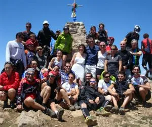

El pasado sábado se celebró esta novedosa prueba de carácter único con gran éxito de participación.

<table align="center" cellpadding="0" cellspacing="0" style="margin-left: auto; margin-right: auto; text-align: center;"><tbody><tr><td style="text-align: center;"></td></tr><tr><td style="text-align: center;">Alberto&Lucía con los globeros</td></tr></tbody></table>
Muchas gracias a todos los asistentes por hacer del 16/6/2012 una fecha especial, llena de risas, lágrimas, abrazos, sorpresas, cucañas, más lágrimas,... ;-)

Gracias al <a href="http://www.cuartetosibelius.com/" target="_blank">Cuarteto Sibelius</a> por deleitarnos con su música.

Al violín y al coro que entró en acción, y por sorpresa, en la cima.

Y una <b>mención especial</b> a Inazio y Make, Loren e Isa, Álvaro, Pablo,... y todos aquellos que echaron una mano con la logística de este evento. 

