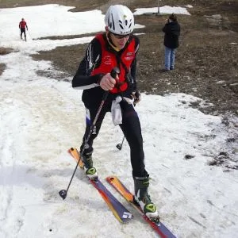
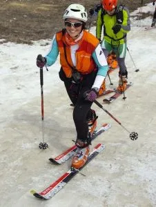
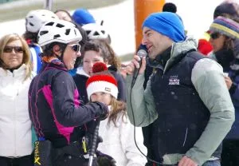
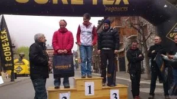

<table cellpadding="0" cellspacing="0" style="float: right; margin-left: 1em; text-align: right;"><tbody><tr><td style="text-align: center;"></td></tr><tr><td style="text-align: center;">AlbertoEpic</td></tr></tbody></table>El pasado domingo se disputó en Benasque una competición novedosa, consistente en combinar una prueba de BTT con una carrera por montaña y un rally de esquí de travesía.

Se organizaba la prueba un poco a modo de experimento, sin saber muy bien cuál sería la acogida de algo así. Podía hacerse en dos modalidades: individual y por equipos de tres, corriendo cada uno en una disciplina.

<table cellpadding="0" cellspacing="0" style="float: left; text-align: left;"><tbody><tr><td style="text-align: center;"></td></tr><tr><td style="text-align: center;">Luzia comenzando el sector 

de esquí de montaña.</td></tr></tbody></table>Hasta allí nos acercamos los integrantes de la factoría SQLP. Pese a participar en la modalidad individual, la verdad es que se echó de menos unos sectores bastante más largos.

Y es que somos demasiado diésel para estas pruebas tan explosivas... :-)

Si sientes curiosidad, aqui puedes marujear los resultados:

<a href="http://p-guara.com/esquiMon/2012/04-15/resultados.htm">http://p-guara.com/esquiMon/2012/04-15/resultados.htm</a>

<table cellpadding="0" cellspacing="0" style="float: right; text-align: right;"><tbody><tr><td style="text-align: center;"></td></tr><tr><td style="text-align: center;">Luzia es entrevistada tras

cruzar la línea de meta.</td></tr></tbody></table>Luzia consiguió un meritorio 2º puesto en categoría femenina (2h 49' 50''), superando incluso a varios equipos de relevistas femeninas (4ª).

Por su parte, AlbertoEpic quedó el 9º de entre 71 participantes en categoría masculina (2h 25' 21''), y sólo 4 equipos mejoraron su tiempo.

Hizo un día de perros, viento, frío, una nevada cada vez más intensa... en fin, un día ideal para emplearlo en una competición en lugar de ir deambulando por el monte en plan contemplativo con la cámara de video echando humo...

Como ya es habitual, una excelente organización a cargo de Peña Guara, que cada prueba se supera!

<table align="center" cellpadding="0" cellspacing="0" style="margin-left: auto; margin-right: auto; text-align: center;"><tbody><tr><td style="text-align: center;"></td></tr><tr><td style="text-align: center;">Pódium femenino: Luzia, Gurutze y Amaia</td></tr></tbody></table>

