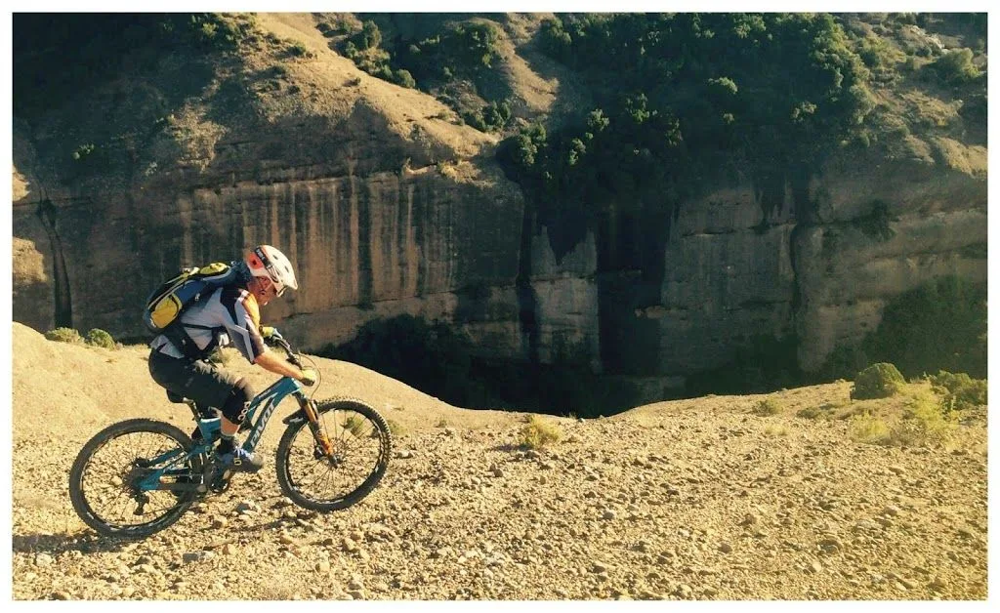
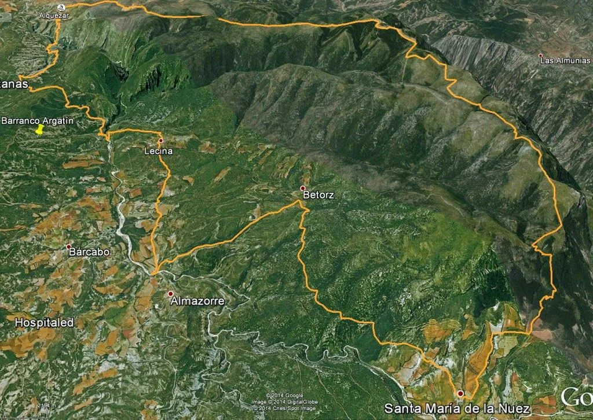
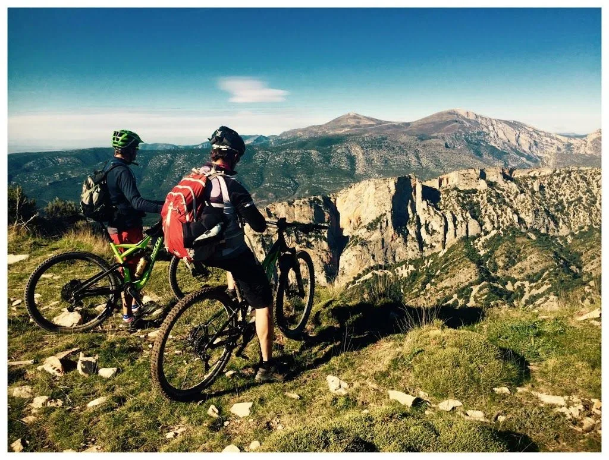
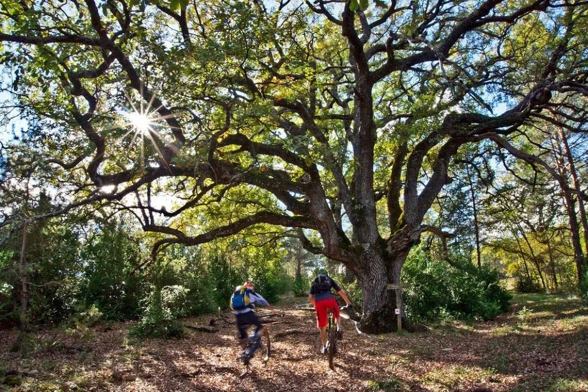
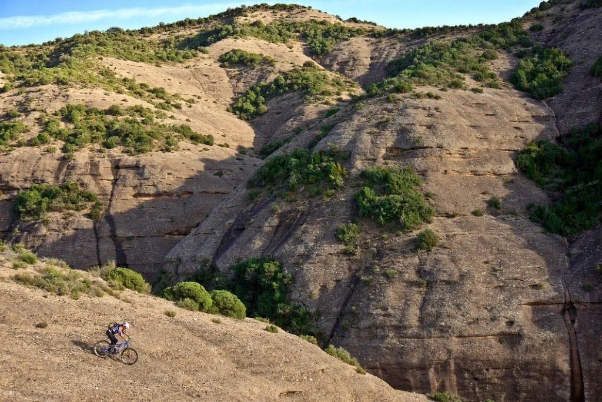
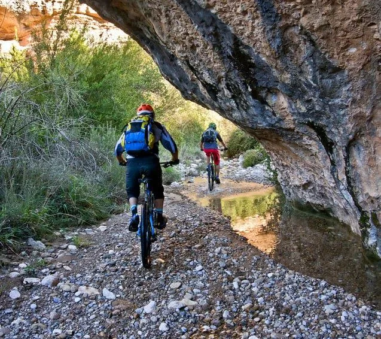
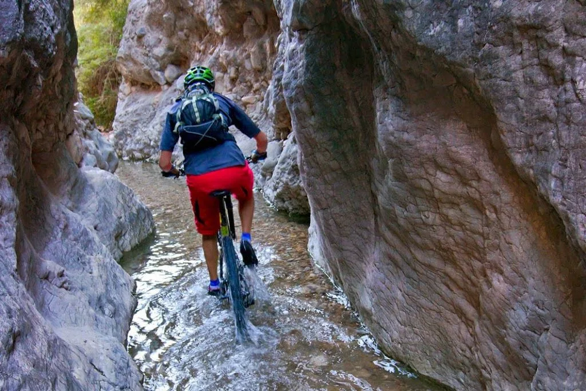
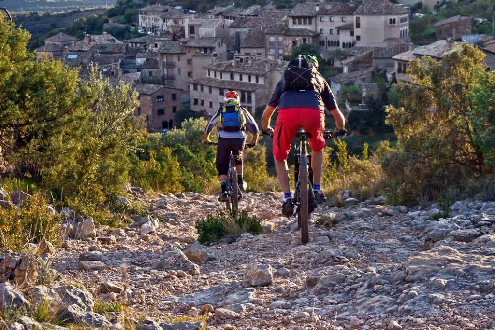
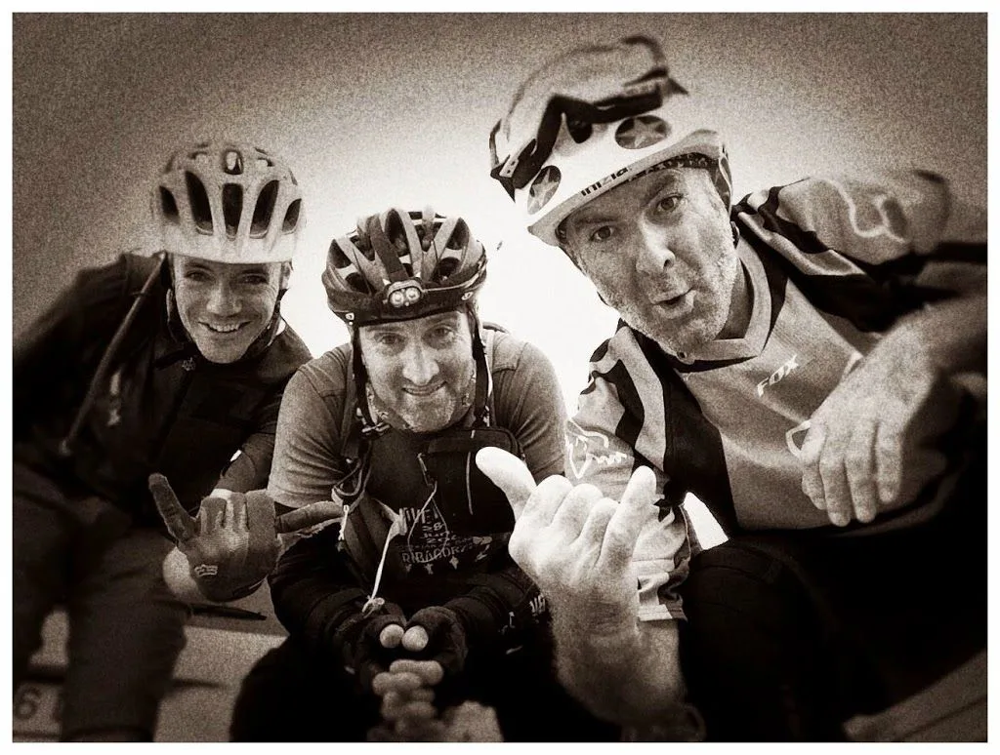

---
title: "Alquézar Five Stars: BTT enduro"
publishDate: 2014-11-08T00:17:00Z
updateDate: 2015-04-06T10:28:22Z
draft: false
author: "AlbertoEpic"
excerpt: "Alguna vez has terminado una ruta de BTT con un porteo cuesta arriba? Posiblemente sí. Pero, ¿alguna vez te daba igual lo largo y duro que fuera ese porteo, porque esa ruta merecía la pena de cualquier forma? El otro día tuve el privilegio "
category: "Bicicleta de montaña"
tags:
  - "btt"
---

Alguna vez has terminado una ruta de BTT con un porteo cuesta arriba? Posiblemente sí. Pero, ¿alguna vez te daba igual lo largo y duro que fuera ese porteo, porque esa ruta merecía la pena de cualquier forma?

El otro día tuve el privilegio de experimentar tales sensaciones, acompañado de dos míticos: Quiri, famoso por sus incendiarias entradas semanales en Facebook, y Rafa, el culpable de la concepción de esta ruta mítica, MÍTICA (Y ojo, digo 'mítica' con mayúsculas).

El asunto empieza gris, con una subida desde Alquézar al Mesón de Sevil, pero poco después todo cambia: se entra en una embriagadora sucesión de senderos rápidos que, a pesar de estar ya reventado, no dejan que se te pase por la cabeza el terminar ya, sólo quieres seguir y seguir!
Ruta totalmente recomendable, eso sí, que te pille en forma y habilidoso...

El track de la ruta: <a href="http://es.wikiloc.com/wikiloc/view.do?id=8201867" target="_blank">http://es.wikiloc.com/wikiloc/view.do?id=8201867</a>
<table style="margin-left: auto; margin-right: auto; text-align: center;" cellspacing="0" cellpadding="0" align="center">
<tbody>
<tr>
<td style="text-align: center;"></td>
</tr>
<tr>
<td style="text-align: center;">Itinerario de la ruta, circular desde Alquézar.</td>
</tr>
</tbody>
</table>
<table style="margin-left: auto; margin-right: auto; text-align: center;" cellspacing="0" cellpadding="0" align="center">
<tbody>
<tr>
<td style="text-align: center;"></td>
</tr>
<tr>
<td style="text-align: center;">Pasado el Mesón de Sevil. (Foto: Quiri)</td>
</tr>
</tbody>
</table>
<table style="margin-left: auto; margin-right: auto; text-align: center;" cellspacing="0" cellpadding="0" align="center">
<tbody>
<tr>
<td style="text-align: center;"></td>
</tr>
<tr>
<td style="text-align: center;">Un matojo elegante... (Foto: Rafa)</td>
</tr>
</tbody>
</table>
<table style="margin-left: auto; margin-right: auto; text-align: center;" cellspacing="0" cellpadding="0" align="center">
<tbody>
<tr>
<td style="text-align: center;"></td>
</tr>
<tr>
<td style="text-align: center;">Descenso al fondo del barranco de Lumos. (Foto: Rafa)</td>
</tr>
</tbody>
</table>
<table style="margin-left: auto; margin-right: auto; text-align: center;" cellspacing="0" cellpadding="0" align="center">
<tbody>
<tr>
<td style="text-align: center;"></td>
</tr>
<tr>
<td style="text-align: center;">Quiri sobre el barranco de Lumos. (Foto: Rafa)</td>
</tr>
</tbody>
</table>
<table style="margin-left: auto; margin-right: auto; text-align: center;" cellspacing="0" cellpadding="0" align="center">
<tbody>
<tr>
<td style="text-align: center;"></td>
</tr>
<tr>
<td style="text-align: center;">Barranco de Lumos. (Foto: Rafa)</td>
</tr>
</tbody>
</table>
<table style="margin-left: auto; margin-right: auto; text-align: center;" cellspacing="0" cellpadding="0" align="center">
<tbody>
<tr>
<td style="text-align: center;"></td>
</tr>
<tr>
<td style="text-align: center;">'Ciclobarranquismo' en el Lumos... (Foto: Rafa)</td>
</tr>
</tbody>
</table>
<table style="margin-left: auto; margin-right: auto; text-align: center;" cellspacing="0" cellpadding="0" align="center">
<tbody>
<tr>
<td style="text-align: center;"></td>
</tr>
<tr>
<td style="text-align: center;">Llegando a Alquézar, fin de la ruta. (Foto: Rafa)</td>
</tr>
</tbody>
</table>
<table style="margin-left: auto; margin-right: auto; text-align: center;" cellspacing="0" cellpadding="0" align="center">
<tbody>
<tr>
<td style="text-align: center;"></td>
</tr>
<tr>
<td style="text-align: center;">Fin de la ruta, ya tenemos nuestra ración de endorfinas para aguantar otra semana más... (Foto: Quiri)</td>
</tr>
</tbody>
</table>

