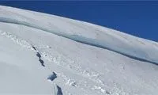
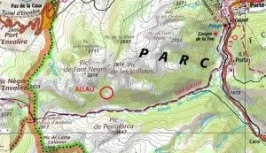
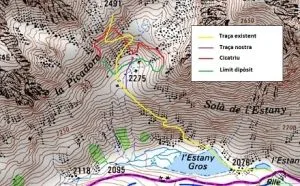
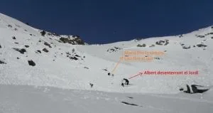
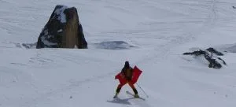

De la mano de Gil d'Asprer me ha llegado esto: una buena descripción, en la <a href="http://www.acna.cat/" target="_blank">página del ACNA</a>, de una avalancha que afectó a 6 personas, grupo de Albert Castellet. Debido a su interés para todos los que nos movemos por montaña en invierno, reproduzco aquí su contenido en castellano (Versión traducida por Google sin revisar, perdón por los errores). Si quieres ver el original haz <a href="http://www.acna.cat/accidents/relatsaccidents/140201_Accident_Campcardos/index.htm" target="_blank">click aquí</a>.

////////////////////////////////////////////////////////////////////////////////////////////

<strong style="font-size: 12px; text-align: -webkit-center;">Alud en el Valle de Campcardós</strong> (26 de enero de 2014)

<table border="0" style="color: white;"><tbody><tr><td colspan="2">
DATOS

Día: Domingo 26 de enero de 2014.

Hora: 13:00.

Lugar: Valle de Campcardós, Puerta, Cerdanya francesa.

Riesgo (boletín): 3/4

Meteo: Temperatura suave, solo.

Tipo de alud: Alud de placa de viento, un poco húmeda.

Orientación: S

Altura: 2300 a 2450 metros

Pendiente: Entre 20 º y 30 º.

Dimensiones:

            Longitud: 250 metros.

            Desnivel: 150 metros.

            Cicatriz: 500 metros de longitud.

                                   30 a 100 cm de espesor.

            Depósito: pendiente suave, de 2 a 3 metros de espesor.

Desencadenamiento: Por el peso de una persona, saltando ligeramente, en la parte inferior de la placa. Propagación 200 metros más arriba y 500 metros de lado.

Víctimas: Arrastradas entre 10 y 25 metros.

                        1 persona enterrada que sólo le salía parte de la cara.

                        1 persona enterrada hasta el cuello.

                        1 persona enterrada hasta la cintura.

                        1 persona enterrada hasta media pierna.

                        1 persona puede refugiarse bajo una roca y no es arrastrada.

                        1 persona consigue escaparse por debajo.

                        Hay desenterrar las primeras 3 con palas.
                       

Todos sin lesiones físicas, alguien afectado psicológicamente.
                       

<strong>DESCRIPCIÓN</strong>
                       

<strong>Previos ...</strong>

A las 10.30 aproximadamente salimos de Puerta con la intención de enfilar el Valle de Campcardós y, según como vemos el estado de la nieve, subir por la ladera izquierda del valle en la dirección que vamos (orientación norte) hacia el Puigpedrós si no hay placas de viento o seguir por el valle hacia el Pico Negro de en Valira. Somos 6.

Por el fondo del valle la nieve está helada en superficie por la lluvia del día anterior, pero debajo muelle y con un buen grosor de entre 50 y 100 cm a partir de los 1800 metros. La vertiente norte se ve muy aventado por arriba con poca nieve y no nos acaba de convencer. Vamos comentado las avalanchas que se ven, sobre todo placas en las laderas sur y este. Por debajo da la sensación de que la nieve está muy húmeda. Seguimos por el fondo del valle hasta la cabaña.

Seguimos por el valle y media hora más adelante vemos unas trazas que trepan por la ladera sur (hacia la derecha), en dirección a los picos de Fontnegra. Comentamos que parece que se metan en la boca del lobo, ya que es la vertiente donde debería haber más placas de viento (ha soplado de norte oeste). Sin embargo, la primera pala se ve transformada, ya hace un rato que le da el sol, con nieve húmeda y no parece que aquí haya placas. Más arriba seguro que sí. Algunos opinan que seguir por el fondo del valle, la opción más segura. Otros están hartos de tanta valle plana y alguien empieza a tener llagas y prefieren subir un poco por las trazas y si más arriba hay peligro dar media vuelta. Al final decidimos seguir las trazas.

Somos conscientes de que es una opción con menos posibilidades de llegar a ninguna cima y donde tendremos que vigilar mucho con las placas. Prácticamente seguro que tendremos que dar media vuelta más arriba.

En la primera pala de 200 metros de desnivel, tal y como habíamos previsto, no hay placas y la nieve es húmeda. Llegamos a una zona más plana bajo una olla y vemos las trazas que siguen por una pendiente de unos 25 a 30 º orientado al sur, nada modelada por el viento y con mucha pinta de placa. Las trazas cruzan la pala bien por medio. Todavía hay el último esquiador en el tramo final y observo que no se hunde nada. Veo evidente que está sobre una placa de viento y comento con los compañeros la inconsciencia de aquella gente. Esperamos que llegue arriba, a una zona más llana, atentos a si se rompe la placa, pero no ... Comentamos que nosotros por allí seguro que no pasamos, aunque si no se les ha caído quizá no hay tanta placa como parece.

Decidimos ir por la parte baja de la pala en una zona con muchos piedras e intentar subir un poco por allí, a ver cómo está. Paso delante abriendo traza a cierta distancia de mis compañeros. Ya en la parte plana de abajo empieza a haber alguna placa no demasiado grande.Boto, pero no peta nada. Sigo por la parte baja de la pala hacia la zona con rocas y vi cruzando alguna plaqueta de no más de 10 metros.Voy saltando con la intención de ver si peta alguna plaqueta pequeña entre las piedras, pero nada. No veo demasiado claro que podamos seguir mucho más allá, pero por ahora si peta algo las placas parecen pequeñas y en todo caso fracturaría por las rocas (gran error!).
</td></tr><tr><td width="50%">

</td><td width="50%">

</td></tr><tr><td>
Lugar donde se produjo la avalancha
</td><td>
Detalle con los itinerarios trazados y la cartografía de la avalancha
</td></tr></tbody></table>
<strong>La avalancha</strong>

Entro en una nueva placa y vuelvo a hacer un pequeño bote y entonces sí, WOOOM!, El típico ruido de las placas de viento, pero muy, muy fuerte. Miro rápido por encima de mí, por las piedras y más arriba toda la pala y no veo ninguna fractura ni movimiento. Enseguida, sin embargo, sentimos un ruido y 300 metros a la derecha empieza a estallar por arriba la pala la placa. La avalancha se desencadenante de derecha a izquierda hacia nosotros. Me da la sensación de que no llegará hasta donde estamos, hay como una hondonada en medio. Alguien grita que qué hacemos. Contesto que bajamos hacia la izquierda en dirección a las piedras para alejarnos de la avalancha. Hago una vuelta maría, comienzo a tirar un poco atrás y de repente veo como comienza a romperse la pala 200 metros por encima nuestro. Sálvese quien pueda! Mientras veo las olas de nieve que bajan rápidamente hacia nosotros consigo llegar por los pelos a una roca que desploma un poquito. Una última mirada a la nieve que baja feroz y cuando ya casi la tengo encima me agacho bajo la piedra e intento que la avalancha no me lleve. Noto su fuerza a los esquís y mochila que sobresalen, pero consigo aguantarme. Se hace oscuro e instintivamente me hago espacio con las manos por si quedo enterrado poder respirar. Poco después todo se detiene.

Estoy bien y puedo salir rápidamente. Siento gritos y veo Félix con el ABS abierto y sólo con las piernas enterradas que llama que está bien.Andrea abajo del todo está fuera de la avalancha. A la izquierda veo a Maria medio enterrada y Laia que sólo le sale la cabeza. Esquío rápidamente hacia ellas y me dicen que están bien. Falta Jordi y observo más abajo algo que se mueve. Bajo allí, está casi totalmente enterrado y tiene la cara medio tapada de nieve, pero me dice que está bien.

Le digo a Andrea que está abajo que no suba y haga de vigía para avisar si hay una segunda avalancha. Comienzo a desenterrar el Jordi con la pala mientras Félix consigue salir él solo y va a ayudar a desenterrar María y Laia. A ninguno de los que han quedado enterrados saltan los esquís y Jordi que llevaba los palos con las dragoneras no se puede mover nada. 15 minutos más tarde estamos todos fuera, nadie ha tomado mal. Conseguimos encontrar todos los esquís, pero perdemos dos palos.

Bajamos sin demasiado dilaciones hacia el coche. Alguien queda tocado por el susto, otros mucho menos. Pero todos sacamos una experiencia importante que nos permitirá valorar mucho mejor el riesgo en el futuro.
<table border="0" style="color: white;"><tbody><tr><td colspan="2">
<table align="center" cellpadding="0" cellspacing="0" style="margin-left: auto; margin-right: auto; text-align: right;"><tbody><tr><td style="text-align: center;"><a href="http://www.acna.cat/accidents/relatsaccidents/140201_Accident_Campcardos/3%20Campcard%C3%B3s_m.jpg" style="clear: right; margin-bottom: 1em; margin-left: auto; margin-right: auto;"></a></td></tr><tr><td style="text-align: center;">En amarillo: traza preexistente, en lila: traza nuestra; 

en rojo: cicatriz del alud</td></tr></tbody></table>

</td></tr><tr><td colspan="2"></td></tr><tr><td width="50%"></td><td width="50%"></td></tr><tr><td colspan="2"></td></tr><tr><td colspan="2">
Imágenes del rescate
</td></tr></tbody></table>
<strong>ANÁLISIS</strong>

<strong>La avalancha</strong>

Mi (nuestra) interpretación de lo que pasó es la siguiente:

Los tres esquiadores que iban delante no desencadenó el alud, ya que pasaron por el medio de la pala donde la placa era más gruesa y no llegaron a romperla (aunque no creo que faltara masa).

En el momento que provocó la avalancha, yo debería entrar por el extremo inferior de la placa. Aunque el pendiente aún era suave (20 º máximo), allí la placa debería ser más delgada y provoqué un asentamiento que se propagó por toda la placa rompiéndose esta 200 metros más arriba en la zona convexa cuando ya perdía pendiente. También se propagó hacia la derecha pasando la hondonada y provocando una fractura en la parte alta de las palas de más a la derecha, siguiendo puntos débiles entre rocas.

La fractura de la pala principal sobre nuestro no fue suficiente en un primer momento para que la placa bajas, pero la fractura de las palas de la derecha se fue propagando hasta que a la derecha del todo debería acabarse la placa y, al quedar despegada, empezó a bajar por ese extremo. La avalancha fue cayendo de derecha a izquierda siguiendo la fractura hasta la hondonada.

No tengo muy claro si fue la continuidad de la placa o la vibración producida por el alud, que provocaron que la pala ya fracturada sobre nuestro que en un principio no se había movido, acabara cayendo también y nos enganchara.

Cabe destacar que el hecho de que la pendiente fuera disminuyendo de forma progresiva evitó que el depósito fuera demasiado profundo y enterrara más los que fueron arrastrados.<strong></strong>

<strong>Nuestra actuación</strong>

Éramos conscientes del riesgo y estábamos valorar correctamente donde había placas de viento.

El error fue no ver que la placa era muy grande y continua y suficientemente rígida para transmitir las tensiones a cientos de metros. Creí que si reía alguna placa en la parte baja y más llana de la pala entre las piedras, la fractura sería cercana por las piedras y la placa que caería sería de pequeñas dimensiones. Mi sobrepeso provocó una fractura 200 metros más arriba, que se propagó 500 metros a la derecha antes de empezar a caer nada.

Seguro que también influyó el hecho de que hubieran pasado tres personas delante por medio de la pala sin que pasara nada. Aunque nosotros decidimos no seguirlos, estoy seguro de que si no hubiera habido nadie delante, nosotros habríamos dado media vuelta. De hecho ya ni nos habríamos subido por la vertiente sur.

No entro aquí a analizar la influencia de la dinámica de grupo en el accidente. Personalmente creo que el factor grupo influyó en las decisiones que hicimos tomar, pero poco o nada en el accidente en sí.

El ABS de Félix funcionó perfectamente, manteniéndolo a la superficie.

<strong>Lecciones</strong>
<ol style="color: white;"><li style="color: black; font-size: 12px;">Un alud de placa producido por una sobrecarga puede fracturar la placa a unos cientos de metros de distancia del punto de aplicación, aunque haya puntos débiles (rocas, árboles, zonas convexas, ...) por medio que parezcan indicar que la placa fracturaría por allí.</li><li style="color: black; font-size: 12px;">Las dragoneras los postes y los esquís ligados inmoviliza si quedas enterrado. Aunque yo no creo que haya que ir siempre sin las dragoneras (tal y como dice el famoso <em>decálogo de una buena progresión en terrenos de aludes</em> ), sí es importante no poner las manos cuando prevemos que hay un cierto riesgo.</li><li style="color: black; font-size: 12px;">Que alguien pase por una pala y no desencadene una avalancha no significa demasiado nada.</li><li style="color: black; font-size: 12px;">Las placas se rompen más fácilmente por los bordes (zona más delgada) que por el centro (más grueso). <strong>Atención!</strong> Con esto no quiero decir que si tenemos que cruzar una tengamos que ir por medio, ya que si la rompemos estando en medio, tenemos mucha nieve por encima y tramo para ser arrastrados ... En todo caso, si una placa puede estallar, mejor no cruzarla por parte!</li><li style="color: black; font-size: 12px;">El ABS funciona muy bien.</li></ol>
Si desea comentar algún punto de este informe o que ampliemos alguna información, no dude en contactarnos.

 Albert Castellet

albert.castellet @ gmail.com

Martinet, 28 de enero de 2014

<table border="0" style="color: white;"><tbody><tr><td>

</td></tr></tbody></table>

