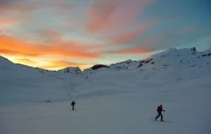
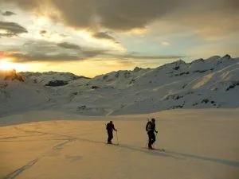
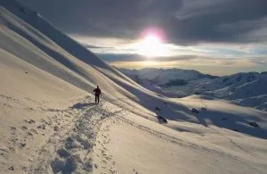
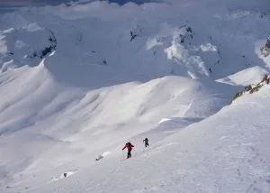

En un fin de semana lleno de nevadas por todas partes, los globeros Morenetti y AlbertoEpic han conseguido aprovechar las escasas 3 horas de tregua que dio el tiempo en todo el fin de semana. Con Sara, fueron siguiendo de cerca a Jorge, Alex y Héctor, que les llevaban 15min de ventaja.

A continuación, cito la pequeña crónica de Jorge García-Dihinx, con algunas de sus fotos:

Con el frente atlántico entrando desde Navarra el sábado por la mañana, breve era el hueco del que disponíamos los maños para hacer algo con esquís (salvo los que se fueron al Valle de Benasque, que tuvieron un par de horas más de sol).

Así pues, madrugamos como en primavera y a las 8 AM salíamos con esquís con las primeras luces desde el parking de Aneu (Portalet) en dirección al Peyreget. “Belle matinée”, como anunciaba Meteo France (bella pero muy breve…). Desde el collado de l’Ou, fuertes vientos y panorama negro que llegaba desde el oeste.

Hacemos cima poco antes de las 10 justo antes de que entre por fin todo el marrón. Cielos cubiertos y fuertes vientos de ahí en adelante. Descenso con escasa visibilidad pero se podía disfrutar, por lo menos hasta el collado. Mereció la pena levantarse para disfrutar, para nosotros solos, de ese bello amanecer en el Portalet.

Jorge

