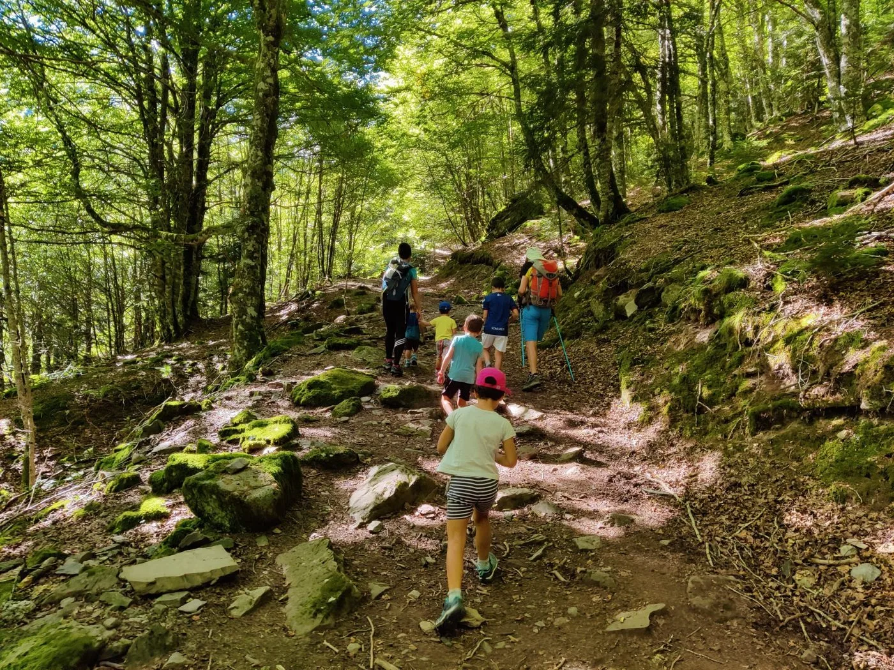
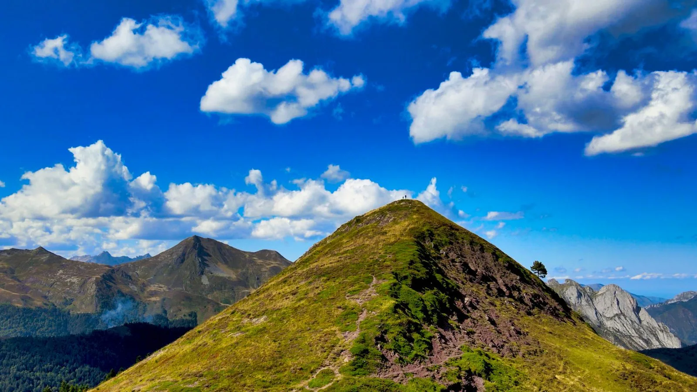
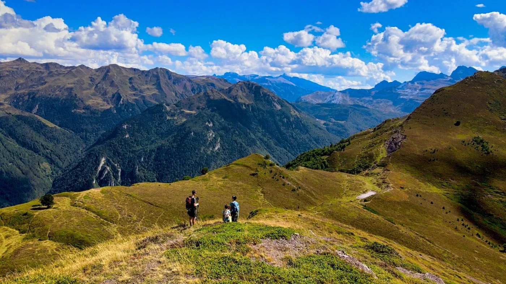

La excursión propuesta hoy es ideal como una de las primeras cimas para un niño. El terreno es el típico del Pirineo francés, donde escasean las piedras y abundan los senderos cómodos a través de bosques y prados.

La Cristallère es una cumbre del Valle de Aspe situada en el sector oriental del Circo de Baralet. Al parecer el nombre de la montaña hace referencia a la presencia de cristales de cuarzo en el subsuelo.

Te dejamos a continuación con unas breves imágenes de vídeo a vista de drone para que conozcas la parte superior de la ruta:https://youtu.be/sPXEnBqkHf4Si quieres poner nombre a todos los picos que se ven desde su cima, en <a href="https://pano360.soloquedalopeor.com/" target="_blank" rel="noopener"><b>Pano360</b></a> puedes ver la foto esférica correspondiente:
<a href="https://bit.ly/LaCristallere" target="_blank" role="button" rel="noopener">
Ver foto esférica desde la cima
</a>
Hemos añadido el track a nuestra base de datos, por si quieres descargarlo para repetir la actividad. Únicamente representa la ascensión hasta la cima, pasando por una fuente de agua potable y una cabaña de pastores donde si tienes suerte podrás comprar queso.
<iframe src="https://www.alltrails.com/es/widget/map/map-a160a01--44?scrollZoom=false&hideName=true&u=m" width="100%" height="400" frameborder="0" scrolling="no" marginheight="0" marginwidth="0" title="AllTrails: Trail Guides and Maps for Hiking, Camping, and Running"></iframe>
También puedes ver el track animado sobre una representación en 3D, que siempre queda más futurista... ;-phttps://video.relive.cc/274354648501_garmin-health_1632555437464.mp4Para terminar, te dejamos con algunas fotos de la jornada, realizada el segundo domingo de septiembre 2021.

*En la parte baja del valle se atraviesan bonitos hayedos. (Foto: Chus)*

*En la antecima.*

*Descendiendo hacia el collado.*
