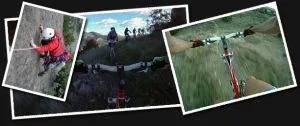

En Producciones Soloquedalopeor estamos en crisis: la calidad de nuestras últimas producciones ha desbordado la capacidad de nuestras computadoras, que se han negado a renderizar ni un vídeo más si no les damos más RAM y más memoria dedicada en la tarjeta gráfica.

Así que por el momento tenemos aqui dos espectaculares superproducciones (Pacino y Finestres) que no somos capaces de renderizar con nuestros medios. Tenemos el material, pero no tenemos el ordenador necesario para convertir el trabajo en algo que todos los cibernautas podáis ver.

De momento no tenemos dinero suficiente para comprar el ordenador necesario. Si quieres seguir pasando un buen rato con los videos de Producciones Soloquedalopeor, puedes ser nuestro mecenas y hacer un donativo. Todo el dinero recaudado será destinado íntegramente a la compra de un nuevo ordenador.

 

<i>En SoloQuedaLoPeor somos agradecidos: si haces un donativo, erigiremos en tu honor una estatua de mármol de 3m en el centro de nuestro jardín!</i>

