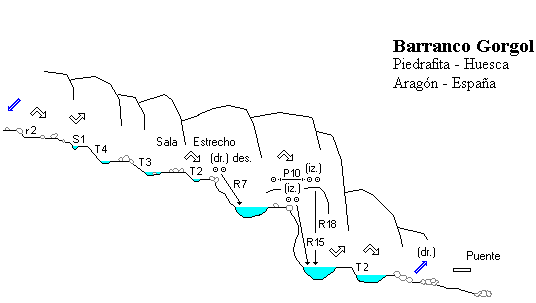

<h3>>> if (Ola de calor): do "Barranco"; else 'ver el Tour';</h3>
Con la ola de calor que estamos sufriendo, se imponía una actividad acuática y sencilla, sin presiones, para pasar la tarde. Y qué mejor que el a menudo masificado (Por las mañanas) barranco de Gorgol. Nuestro especialista AlbertoEpic, en un alarde de atrevimiento (O más bien inconsciencia?) no dudó en llevarse el dron para dar un aliciente añadido al sencillo y breve descenso.

Puedes ver a continuación un breve vídeo grabado desde el Albertdrón:https://youtu.be/NLDOV-gGpnkEl barranco Gorgol se encuentra en la zona de Piedrafita de Jaca, y es un destino muy común para los guías con sus grupos de clientes. Tienes <a href="https://www.docuwiki.infobarrancos.es/doku.php?id=barrancos:huesca:gorgol" target="_blank" style="font-family: var( --e-global-typography-text-font-family ), Sans-serif; font-weight: var( --e-global-typography-text-font-weight ); background-color: #ffffff;" rel="noopener"><b>más info haciendo click aquí.</b></a>

<figure>
											<figcaption>Julia en pleno descenso del Gorgol.</figcaption>
</figure>
<figure>
											<figcaption>Loli desmontando el rápel para saltar desde allí arriba! (Fotografía desde el dron)</figcaption>
</figure>
