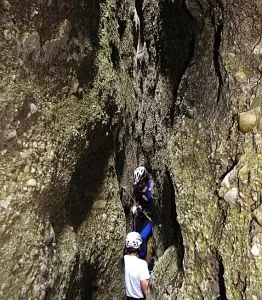
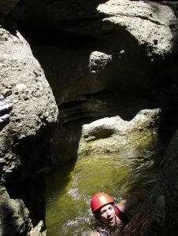
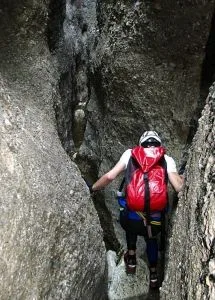

El pasado domingo un puñado de globeros estuvo en el barranco de Lumos. Hubo ausencias amparándose en la posibilidad de pasar calor y tener que respirar una atmósfera hedionda al cruzar marmitas de agua estancada... Pero la actividad causó en los asistentes una grata sorpresa. Gracias a las últimas tormentas, bajaba un hilillo de agua intermitente y no había badinas estancadas y malolientes. Además, buena parte del descenso discurre a la sombra, por lo que el sol no nos achicharró.

Entre los globeros se llegó a la conclusión de que este barranco no es simplemente estrecho, más bien es ESTRECHISMOOOO! Y claro, metidos a la sombra en esa profunda grieta en la roca, y con una ligera brisa fresquita, se estaba bastante bien.

A continuación, algunas fotos cortesía de Morenetti, el fotógrafo globeril por excelencia.

