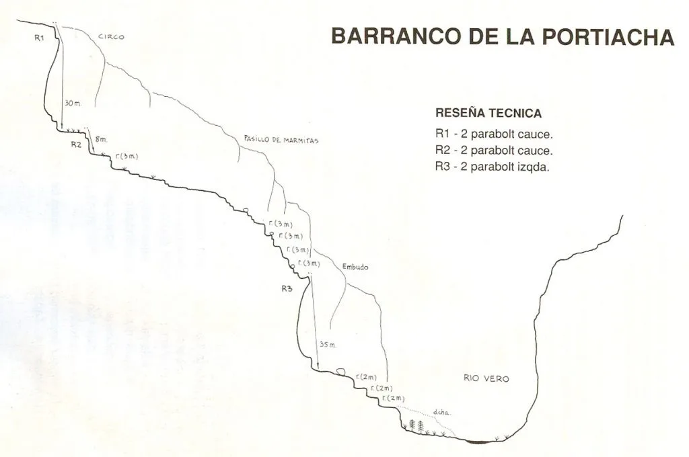

## Larga vida a los rápeles 'volaos'...

Última semana de octubre, última semana con horario de verano, y presumiblemente final de temporada de actividades vespertinas los miércoles por el monte para el TeRReXtrem Team... Como colofón a esta próspera temporada, July y AlbertoEpic eligieron una actividad breve, a la par que variada e intensa.

El barranco de Portiacha es un afluente del río Vero, un barranco seco y cortito compuesto básicamente por dos largos rápeles 'volaos'. Nuestros especialistas dejaron el coche en el parking del Portiacha, un poco antes del parking del Vero de Lecina.

Desde allí, el barranco comienza directamente con el primer rápel, para calentar, después de un suspiro! A continuación puedes ver el croquis:

*Imagen de https://www.docuwiki.infobarrancos.es/doku.php?id=barrancos:huesca:portiacha*

En esta ocasión no vamos a poner el mapa con el track, ya que al ser casi todo el recorrido tan encañonado, la señal GPS es muy mala y prácticamente no nos sirve para nada. Puedes, no obstante, visitar <strong><a rel="noreferrer noopener" href="https://www.alltrails.com/explore/map/mapa-22-de-octubre-de-2022-68881d2?u=m" target="_blank">este enlace</a></strong> donde verás el track del itinerario dibujado sobre el mapa. En él está indicado el sendero cómodo, pero nuestros especialistas eligieron tomar la opción más corta y divertida, por las represas del molino (Ver fotos más abajo).

<figure class="wp-block-image size-large"><figcaption>Sin calentar ni nada, July en el punto de inicio del 'volao' en el primer rápel.</figcaption></figure>

<figure class="wp-block-image size-large"><figcaption>Y ya pasamos al siguiente punto interesante: el último rápel, donde se cae en una marmita mágica...</figcaption></figure>

<figure class="wp-block-image size-large"><figcaption>Desde arriba, July muy pequeñita ya, y todavía no ha llegado a la mitad del rápel...</figcaption></figure>

<figure class="wp-block-image size-large"><figcaption>July aprovechaba para sacar esta foto mítica mientras AlbertoEpic iniciaba el rápel...</figcaption></figure>

<figure class="wp-block-image size-large"><figcaption>Fin del rápel. Prueba superada!</figcaption></figure>

<figure class="wp-block-image size-large"><figcaption>Ahora ya sólo queda remontar el Vero y regresar al parking...</figcaption></figure>

<figure class="wp-block-image size-large"><figcaption>Ambiente otoñal llegando al antiguo molino de Lecina.</figcaption></figure>

<figure class="wp-block-image size-large"><figcaption>Para evitar mojarse (Y hacer un poco más de funambulismo), aprovechan las infraestructuras del molino...</figcaption></figure>

<figure class="wp-block-image size-large"><figcaption>Mucho calor, daban ganas de tirarse... A la izquierda! ;-p</figcaption></figure>

<figure class="wp-block-image size-large"><figcaption>En la vertical del parking del Vero, se sale del cauce y comienza la breve ascensión hacia el parking del Portiacha. A mitad de camino, una buena vista de la ubicación del Molino de Lecina.</figcaption></figure>
