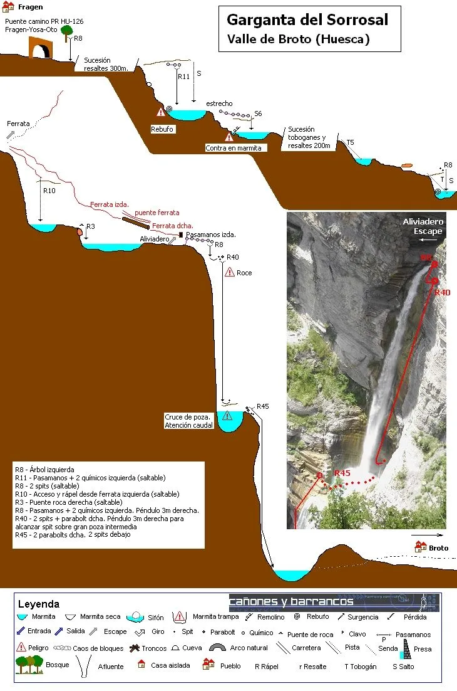

Reseñamos aquí la actividad realizada por Julia y AlbertoEpic, los especialistas de SQLP, a finales del mes de junio. Establecieron su base en Broto, al pie de la cascada del Sorrosal, para pasar un 'día activo'. Para ganarse la comida empezaron por realizar el descenso del barranco del Sorrosal. Como iba 'un pelín pasao' de caudal, desestimaron rapelar la última cascada y aprovecharon para salir del barranco por el final de la vía ferrata.

Y después de comer un bocata en Broto, fueron a por 'el segundo asalto'. Un paseo relajado y entretenido para hacer la digestión: la ferrata del Sorrosal. Desde ella se disfruta de unas excelentes vistas de la cascada de Sorrosal...
<h3>Barranco del Sorrosal</h3>
<iframe src="https://www.alltrails.com/es/widget/map/map-0a11818--52?scrollZoom=false&hideName=true&u=m" width="100%" height="400" frameborder="0" scrolling="no" marginheight="0" marginwidth="0" title="AllTrails: Trail Guides and Maps for Hiking, Camping, and Running"></iframe>
Arriba puedes consultar el track de la aproximación desde Broto hasta el comienzo del descenso del barranco del Sorrosal. Existe alguna variante más, pero en esa ocasión elegimos esta.

*Topo del Sorrosal*
<figure>
											<figcaption>Julia en uno de los rápeles</figcaption>
</figure>
<figure>
											<figcaption>En un pasillo con el característico 'Flysch'</figcaption>
</figure>
<figure>
											<figcaption>Julia 'congelada' en pleno salto</figcaption>
</figure>
<h3>Ferrata del Sorrosal</h3>
Y para superar el bajón del sueño de la siesta, no hay nada como dar un paseo con algo de emoción en esta vía ferrata que nos brinda unas espectaculares perspectivas de la cascada del Sorrosal.

Tienes toda la información de la misma <a href="https://deandar.com/ferratas/via-ferrata-broto" target="_blank" rel="noopener"><b>en este enlace</b></a>.
<figure>
											<figcaption>Julia en el tramo de escaleras de la ferrata.</figcaption>
</figure>
<figure>
											<figcaption>AlbertoEpic haciendo el canelo después del puente tibetano</figcaption>
</figure>
De ocasiones anteriores, y relacionado con el contenido de este post, puedes ver el vídeo del <a href="https://soloquedalopeor.com/2020/07/20/barranco-de-sorrosal/" target="_blank" rel="noopener"><b>descenso del Sorrosal haciendo click aquí</b></a> y un vídeo de la <a href="https://www.youtube.com/watch?v=ilXhjZ-c0nQ" target="_blank" rel="noopener"><b>cascada del Sorrosal a vista de dron haciendo click aquí</b></a>.
