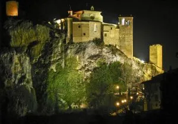
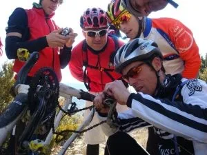
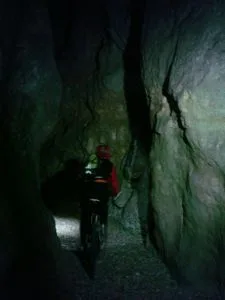

El pasado domingo un nutrido grupo de globeros realizó el denominado por Morenetti como RUTÓN. La hora de salida en Alquézar fueron las 10.00am. Como había que amortizar los 'lupinchines', se fue a ritmo mu tranquilo para que se hiciera de noche en el puente de Villacantal, y realizar el porteo hasta Alquézar con las linternitas, que mola más y cansa menos porque no se ve la subida...

<table align="center" cellpadding="0" cellspacing="0" style="margin-left: auto; margin-right: auto; text-align: center;"><tbody><tr><td style="text-align: center;"></td></tr><tr><td style="text-align: center;">La Colegiata, a nuestra llegada a Alquézar (Foto: Rafa Moreno)</td></tr></tbody></table>La sierra es un entorno duro para la BTT, y eso quedó demostrado una vez más cuando Chus partió de cuajo el cambio  de piñones con un bloque calizo, en plena sierra de Sevil. Le obligó a salir del lugar con la bici a piñón fijo y por una ruta alternativa...

<table align="center" cellpadding="0" cellspacing="0" style="margin-left: auto; margin-right: auto; text-align: center;"><tbody><tr><td style="text-align: center;"></td></tr><tr><td style="text-align: center;">Momentos después del infortunio, haciendo balance de daños... (Foto: Luzia)</td></tr></tbody></table><table cellpadding="0" cellspacing="0" style="float: left; margin-right: 1em; text-align: left;"><tbody><tr><td style="text-align: center;"></td></tr><tr><td style="text-align: center;">Foto: Luzia</td></tr></tbody></table>

Los momentos antes de llegar al puente de Villacantal, recorriendo el barranco del Lumos con la btt y por la noche, resultaron épicos...

Puedes descargar el track de esta ruta en <a href="http://notepierdas.soloquedalopeor.com/ruta.php?id=42" target="_blank">NoTePierdas</a>, la web de rutas de SoloQuedaLoPeor...

