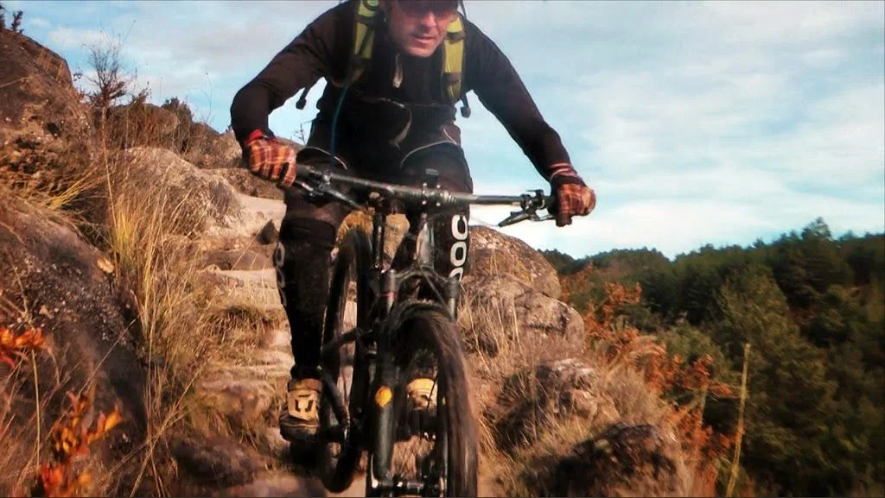

<table cellpadding="0" cellspacing="0" style="float: right; margin-left: 1em; text-align: right;"><tbody><tr><td style="text-align: center;"></td></tr><tr><td style="text-align: center;">Koldo en plena escalinata</td></tr></tbody></table>Dado lo borrascoso de la meteo en el Pirineo para poder hacer una relajada actividad de esquí de travesía, el día de Reyes cambiamos el chip y nos vamos a endurear con las BTT por una de las zonas más dejadas de la mano de Dios...

Partiendo de Bara, recorreremos los pueblos abandonados de Miz, Alatrué y Bibán por unos senderos sencillos pero muy entretenidos.

Todo un placer compartir ruta con unos bikers tan auténticos como Lola, Quiri, Koldo y Leire, que a pesar de mi 'ochentero' aspecto con abundante lycra, me aceptaron en su grupo como uno más... ;-p

A continuación, el video de la actividad:

<iframe allowfullscreen="" frameborder="0" height="370" src="https://www.youtube.com/embed/V98owPFu8yM" width="657"></iframe>

Puedes bajarte el <a href="http://es.wikiloc.com/wikiloc/view.do?id=5911894" target="_blank">track de la ruta de Quiri aqui...</a>

