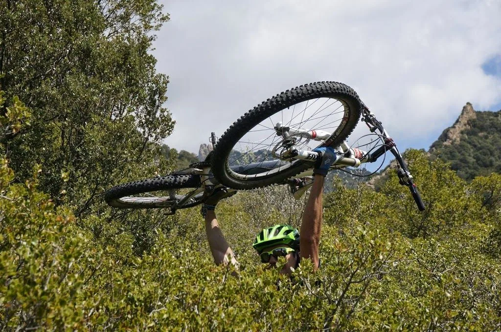
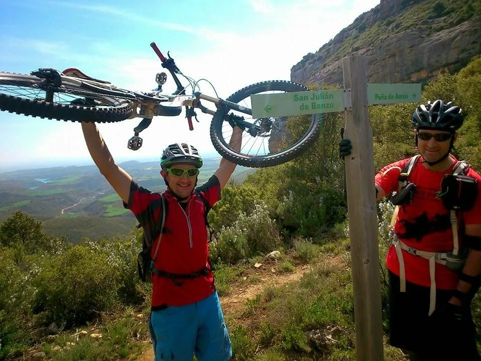
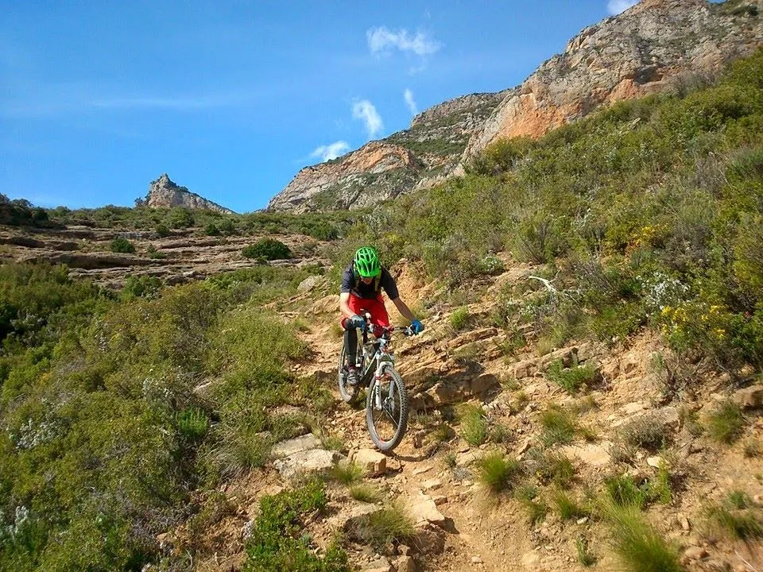

El pasado domingo, por fin, después de mucho tiempo, los globeros Morenetti y AlbertoEpic, acompañados por el vulkanero Marco, realizaron una de esas rutas que te hacen ser consciente del verdadero significado del nombre de esta web: SóloQuedaLoPeor.

<table align="center" cellpadding="0" cellspacing="0" style="margin-left: auto; margin-right: auto; text-align: center;"><tbody><tr><td style="text-align: center;"></td></tr><tr><td style="text-align: center;">Foto: Rafa Moreno</td></tr></tbody></table>Por los datos, de haber sido una ruta ciclable, o al menos con porteos cómodos, se veía asequible:

<ul style="text-align: left;"><li>Distancia: 52km</li><li>Desnivel acumulado en ascenso: 1.822m</li></ul>
Pero algo no iba a salir según lo previsto... Salieron del Viñedo, pasando por Cuello Bail bajaron a Cienfuens, Belsué, Salto Roldán,... Hasta aquí todo fluído y sin problemas, buscando ese ritmo de larga distancia, compromiso ideal entre rapidez (menos horas de ruta = menos cansancio) y ritmo suave (más despacio = menos cansancio).

La bajada al Flumen fue gloriosa, pero... de repente todo cambió. ¿Y la senda? Sí, por aqui se ven restos difusos bajo 2m de vegetación 'serrana' (todo pincha). Sin GPS nos habríamos batido en retirada, pero el maldito track nos dio ánimos para seguir penosamente hacia el collado, arrastrando las bicis entre unas ramas pinchudas que parecían cobrar vida e intentaban arrebatarte la bici constantemente.

Por fortuna todo tiene un final, y después de penar más de lo que se esperaban, se plantaron los tres en el collado de la Peña Amán, con la piel a tiras y más animados que nunca. Tras superar la dura prueba, les esperaba un descenso glorioso!

Para poner la guinda al pastel, deciden ir por el sendero hasta Chibluco y luego hasta el Viñedo, donde llegan tras más de 8h de endurear por la sierra...

Conclusiones: una ruta con tres descensos por sendero buenísimos, pero sólo aconsejable para aquellos que quieran fortalecer su espíritu, tengan complejo de Santa Teresa, o sean masoquistas. 
<table align="center" cellpadding="0" cellspacing="0" style="margin-left: auto; margin-right: auto; text-align: center;"><tbody><tr><td style="text-align: center;"></td></tr><tr><td style="text-align: center;">Foto: Marco Calvo</td></tr></tbody></table>

<iframe frameborder="0" height="500" marginheight="0" marginwidth="0" scrolling="no" src="http://www.gpsies.com/mapOnly.do?fileId=wxwwywsywunsnibj&mode=kmlTour" width="657"></iframe>

