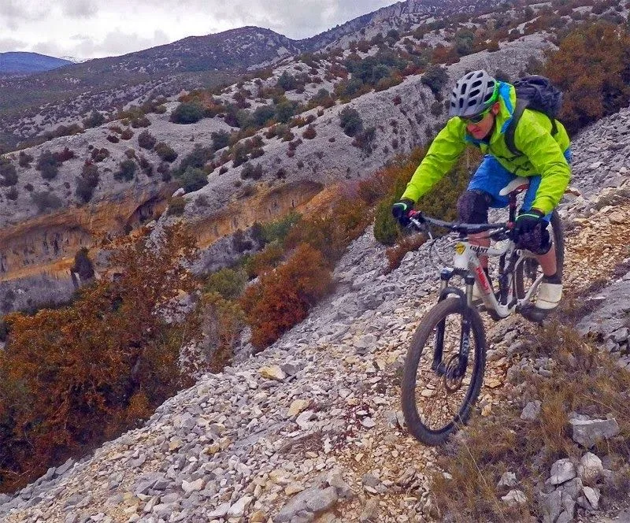

<table cellpadding="0" cellspacing="0" style="float: right; margin-left: 1em; text-align: right;"><tbody><tr><td style="text-align: center;"></td></tr><tr><td style="text-align: center;">Marco en acción (Foto: Koldo)</td></tr></tbody></table>El pasado fin de semana, de nuevo con tiempo revuelto entre ciclogénesis explosivas y demás, un grupo de seres singulares se hizo una ruta de BTT justo antes de que empezara a llover. El día no dio para más, igual que no me da el tiempo para más que un simple video testimonial del avento...

Puedes ver algunas <a href="https://www.facebook.com/media/set/?set=oa.687740354610544&type=1" target="_blank">fotos de Santi en este enlace</a>. Las de <a href="https://www.facebook.com/photo.php?fbid=347526528719958&set=pcb.347528168719794&type=1&theater" target="_blank">Bati están aqui</a>, y también <a href="https://www.facebook.com/luis.demuesalonso/media_set?set=a.651048428291299.1073741856.100001584422799&type=1" target="_blank">las de Koldo...</a>

Con acierto se buscó la zona más caliza de la provincia, donde la formación de barro no deja de ser un hecho esotérico: la sierra de Balced.

<iframe allowfullscreen="" frameborder="0" height="370" src="https://www.youtube.com/embed/vvyrZo5jSGI" width="657"></iframe>

