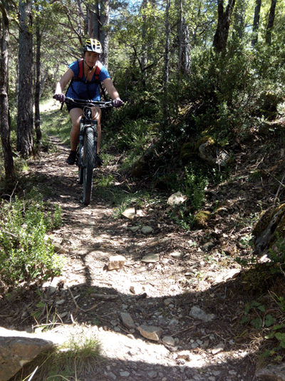
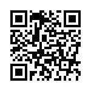

El pasado domingo Luzia y AlbertoEpic gozaron de un breve 'permiso filial' y aprovecharon para escaparse a Fiscal, para hacer esta ruta que les faltaba en la zona. Puedes ver una descripción más detallada de la misma en la <a href="http://www.bttpirineo.com/es/rutas-btt-pirineo/zz-027-solana-sase" target="_blank">web oficial</a>.

Para ser una ruta de la ZonaZero, la verdad es que la encontraron bastante poco rodada. Alguna tromba de agua había borrado el sendero a su paso por un par de zonas de pendientes margas, resultando la broma en dos travesías de esas de pasarte las bicis y cruzar pisando 'sin respirar', mientras te encomiendas a San Hipólito el Bizco...

Puedes ver el mapa con la ruta y descargarte el track en la <a href="https://soloquedalopeor.com/tracks-gps/">sección correspondiente de la web</a>.

<iframe src="http://www.gpsies.com/mapOnly.do?fileId=kahicsgwyeqlqzmo" width="100%" height="500" frameborder="0" marginwidth="0" marginheight="0" scrolling="no"></iframe>

Para los devoradores de cifras:
Distancia: 29km
Desnivel+: 1.405m

Luzia en el descenso hacia Fiscal...

¿Te gustan los códigos QR?
