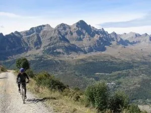
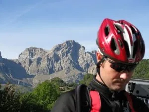
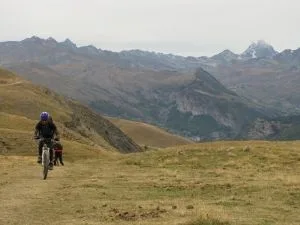
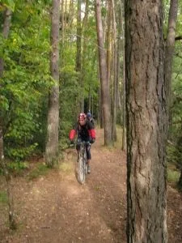

Este pasado sábado unos globeros estuvieron haciendo una ruta de btt por el Pirineo: El Pueyo de Jaca - Hoz de Jaca - Ibón de Sabocos - La Ripera - PR a Panticosa - PR a El Pueyo.

Subida por pista, con fuertes rampas en la estación de Panticosa, y un pequeño porteo desde el ibón de Sabocos hasta el collado.

Prácticamente todo el descenso por PR, es una variante que hace ganar muchos enteros a la vuelta de Sabocos. En su mayoría el PR es sendero ciclable, cuenta con algunos tramos más técnicos reservados a los 'fuera de serie'...

 

