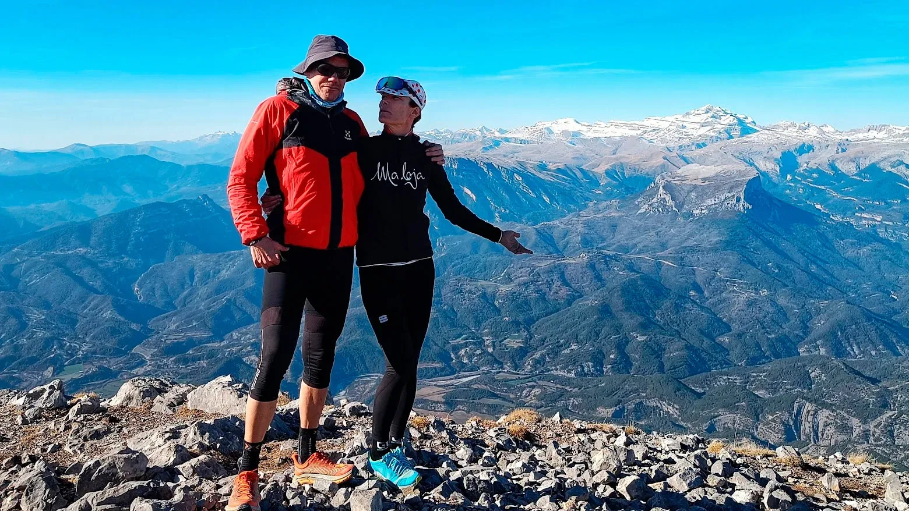

## Una subida muy directa del coche a cima...

El pasado domingo, los especialistas en actividades BTT+pateo del mítico Equipo SQLP, Myriam y AlbertoEpic, estuvieron en la Peña Montañesa. Realizaron una actividad que, debido a su orientación N, debería estar totalmente desaconsejada en estas fechas... Pero 'gracias' al cambio climático estaba practicable 100%.

Salieron en BTT desde el pueblo de Ceresa, y por una pista 'larga pero dura' se plantaron en La Collada, hora y media después. Portearon las bicis un primer tramo de sendero ciclable a la bajada, y enseguida realizaron la transición BTT<-->Pateo.

La subida por esta vía a la Peña Montañesa, por una cada vez más pendiente pedrera que no ve el sol en todo el día durante el invierno, tiene como único aliciente/motivación pensar en la divertida y rápida bajada!

A continuación, el track de la ruta:

<iframe class="alltrails" src="https://www.alltrails.com/es/widget/map/map-dc6a7e6-9?scrollZoom=false&u=m&sh=w4k06q" width="100%" height="400" frameborder="0" scrolling="no" marginheight="0" marginwidth="0" title="AllTrails: Trail Guides and Maps for Hiking, Camping, and Running"></iframe>

Tras superar el fuerte desnivel de piedra suelta en la que, si no eliges el camino óptimo, avanzas un paso hacia arriba y dos hacia abajo, nuestros especialistas se plantaron en la cima en otra hora y media más.

Si no eres muy de leer mapas, debajo puedes ver en un vídeo el itinerario animado sobre un mapa 3D.

<figure class="wp-block-video"><video controls src="https://video.relive.cc/elif-68218731831_garmin-health_1707146868316.mp4"></video></figure>

Después de un buen rato en la soleada cima, compartiendo momentos con gente encantadora de esa que te encuentras por el monte, llegó la hora de regresar al mundo de las sombras, la cara norte en la primera semana de febrero.

Una rápida bajada directa, primero a pie por la pedrera y luego en la BTT, atajando las lazadas de la pista por un sendero balizado como PR.

<figure class="wp-block-image size-full"><figcaption class="wp-element-caption">Myriam en la cima, mirando hacia el norte. Destaca el macizo de Monte Perdido.</figcaption></figure>

<figure class="wp-block-image size-full"><figcaption class="wp-element-caption">Myriam en la cima, mirando hacia el sur. El embalse de Mediano.</figcaption></figure>

<figure class="wp-block-image size-full"><figcaption class="wp-element-caption">Desde la cima, mirando hacia el sur. La Tuca (2.275m), una 'cima gemela' de la principal...</figcaption></figure>

*Los especialistas SQLP Myriam y AlbertoEpic, en la cima de Peña Montañesa.*
