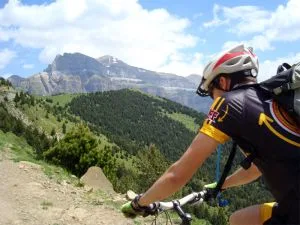
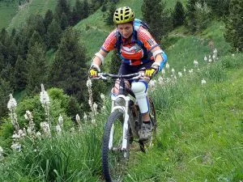
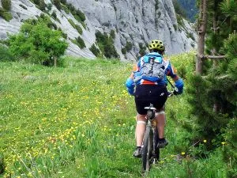

Interrumpimos momentaneamente la emisión de la serie 'Oberland 2011' para mostrar las actividades del último fin de semana, bastante movidito para el equipo de grabación de Soloquedalopeor.

El domingo, una ruta de btt de las pirenaicas:

Luzia y AlbertoEpic salieron de Torla, subieron por pista hasta el repetidor del Cebollar, bajaron al puente de los Navarros por un sendero y desde allí regresaron a Torla. Al final se estaba preparando una gorda, pero todavía les dio tiempo de un bocata en Torla antes de la tormenta.

Y retrocediendo hacia atrás en el tiempo, el sábado el grupo formado por Marcos, Almudena, Raquel, Lucía y Alberto estuvieron partiéndose de risa -estooo... ejem, bajando- estuvieron bajando el Mascún. Próximamente en Soloquedalopeor.

<table><tbody><tr><td>

</td><td>

</td><td>

</td></tr></tbody></table>
