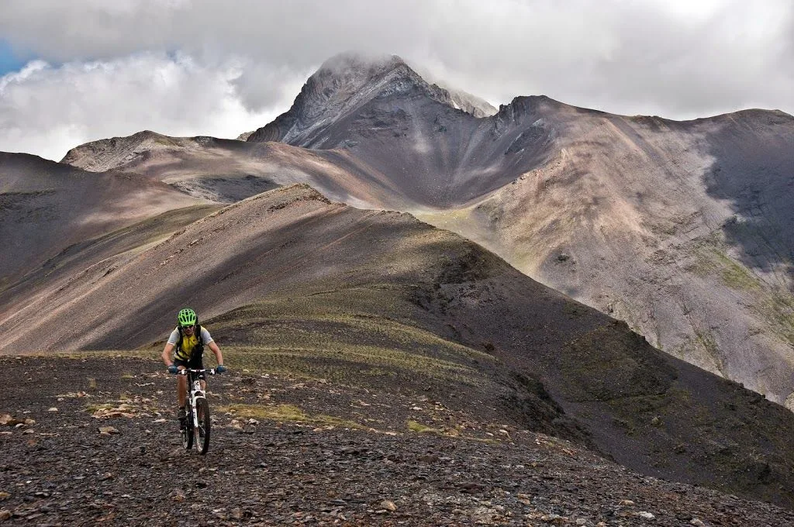

---
title: "Cicloalpinismo: Integral de Sierra Negra"
publishDate: 2014-09-01T21:55:00Z
updateDate: 2015-04-06T10:28:22Z
draft: false
author: "AlbertoEpic"
excerpt: "Pedaleando por el lomo de la Sierra Negra. Foto: Rafa Moreno Era un 16 de agosto de 2014, y los astros se alinearon para que en las atareadas vidas de los globeros Morenetti y AlbertoEpic hubiera un hueco libre para juntarse y acercarse a B"
category: "Bicicleta de montaña"
tags:
  - "Benasque"
  - "cicloalpinismo"
---

<table style="margin-left: auto; margin-right: auto; text-align: center;" cellspacing="0" cellpadding="0" align="center">
<tbody>
<tr>
<td style="text-align: center;"></td>
</tr>
<tr>
<td style="text-align: center;">Pedaleando por el lomo de la Sierra Negra. Foto: Rafa Moreno</td>
</tr>
</tbody>
</table>
Era un 16 de agosto de 2014, y los astros se alinearon para que en las atareadas vidas de los globeros Morenetti y AlbertoEpic hubiera un hueco libre para juntarse y acercarse a Benasque a 'tachar' de su lista de rutas pendientes una de las inexcusables...
Por no coger el coche, AlbertoEpic sale pedaleando de Linsoles y se junta con Morenetti en el camping Aneto. Desde allí, subida a Senarta, Vallibierna, y porteo con algunos tramos ciclables hasta la Tuca de Roques Trencades (2.751m). Prácticamente todo ciclable subidos al cordal de Sierra Negra, paisaje lunar, por el Estibafreda, tuca Royero, hasta Picalbo. Allí 'lo negro' desaparece, y nos zambullimos en el bosque para un descenso vertiginoso hasta las inmediaciones del Camping Ixeia.
Morenetti se queda en la furgo en el camping Aneto, y AlbertoEpic, 'para soltar', continúa por el sendero hasta Benasque, y por Anciles hasta Linsoles.
Sin duda, todo un Rutón de cicloalpinismo. 2 semanas después, todavía nos estamos relamiendo...

El track se encuentra fácilmente en internet. Simplemente un aviso: resulta curioso, una búsqueda en google arroja una mayoría de falsas 'integrales de Sierra Negra'. La mayoría de posts te dicen que han hecho la integral de Sierra Negra, cuando en realidad han realizado únicamente el último descenso, desde la entrada en el bosque. ¿Cómorrr? Desde luego ese descenso es con diferencia el mejor de esta ruta, pero... ni siquiera toca la Sierra Negra! Se están perdiendo toda la zona de mayor altura, más salvaje y de aspecto marciano (Ver foto superior)...

<iframe src="https://www.youtube.com/embed/IiNPQ4TIK4s" width="657" height="370" frameborder="0" allowfullscreen="allowfullscreen"></iframe>

