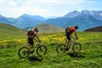
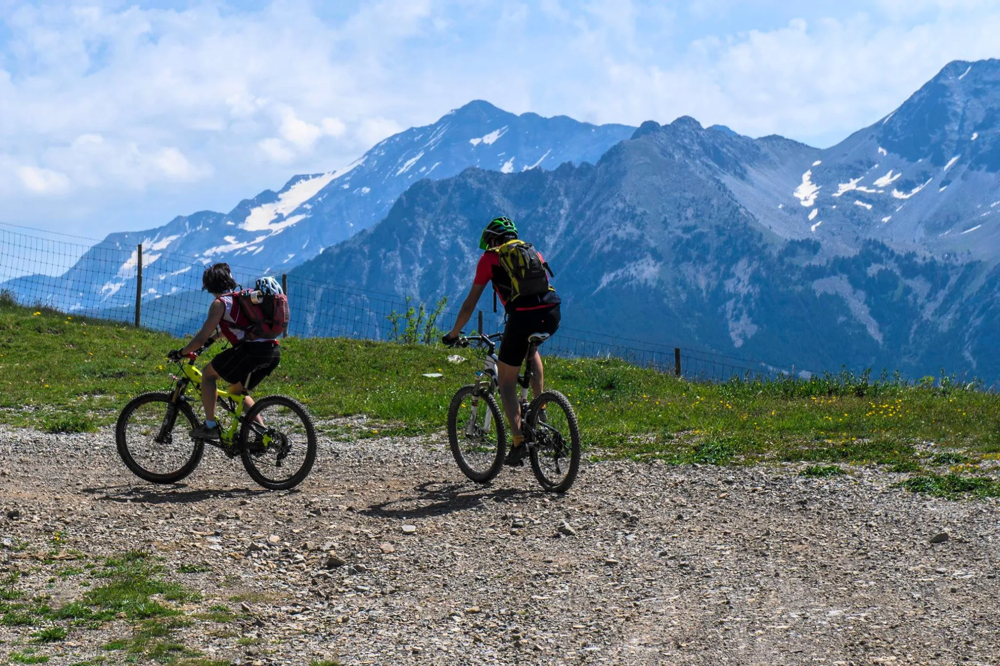
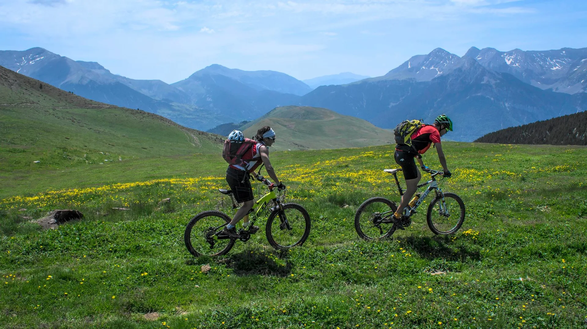
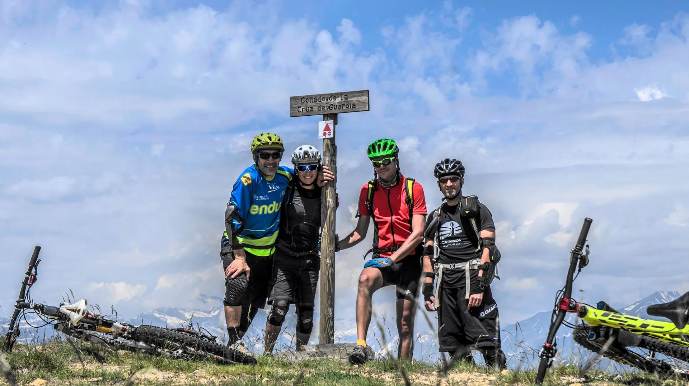
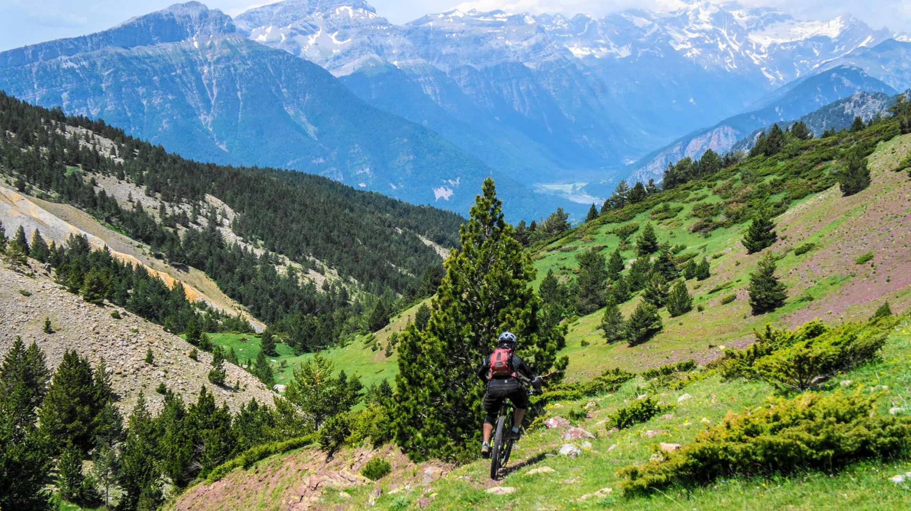
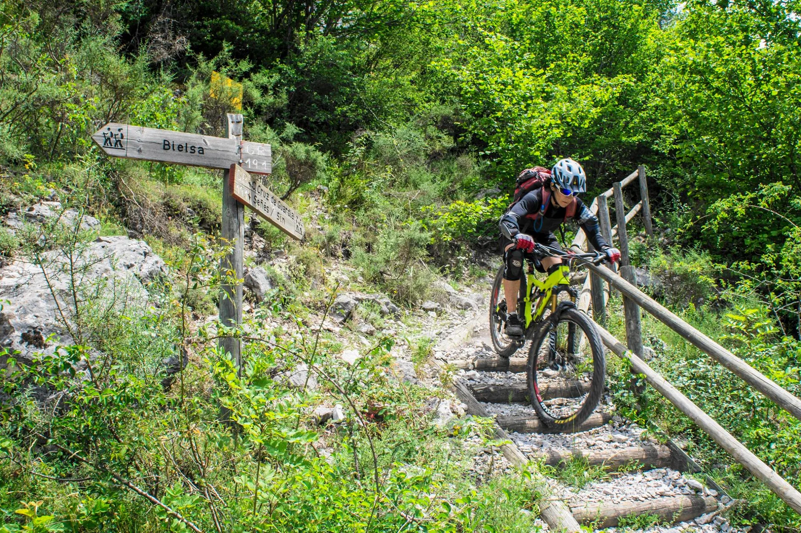

El pasado domingo, tuvo lugar una jornada de convivencia globero-vulkanera: Bati y Lola, de la estirpe de los Vulkanos, se juntaron con Morenetti y AlbertoEpic, del linaje de los Globeros., en el Mesón de Salinas con sus BTT's. La idea era hacer el Canal del Cinca, pero dada la alergia que presentan estos curiosos seres al asfalto, el camino más corto y lógico no servía.

Así pues, la combinación elegida fue: Mesón de Salinas, Sin, Serveto, collado de la Cruz de Guardia, Bielsa, Canal del Cinca, Mesón de Salinas.

<ul style="text-align: left;"><li>47km</li><li>2.270m desnivel+</li></ul>

En SQLP seguimos sin tiempo disponible para editar videos, así que aqui van unas fotos de Bati (En el facebook de Lola), y el track de Rafa...

<table align="center" cellpadding="0" cellspacing="0" style="margin-left: auto; margin-right: auto; text-align: center;"><tbody><tr><td style="text-align: center;"></td></tr><tr><td style="text-align: center;">Subiendo por la pista de las Bordas.</td></tr></tbody></table><table align="center" cellpadding="0" cellspacing="0" style="margin-left: auto; margin-right: auto; text-align: center;"><tbody><tr><td style="text-align: center;"></td></tr><tr><td style="text-align: center;">Llegando al collado de la Cruz de Guardia.</td></tr></tbody></table><table align="center" cellpadding="0" cellspacing="0" style="margin-left: auto; margin-right: auto; text-align: center;"><tbody><tr><td style="text-align: center;"></td></tr><tr><td style="text-align: center;">1000m de bajadón a Bielsa nos esperan...</td></tr></tbody></table><table align="center" cellpadding="0" cellspacing="0" style="margin-left: auto; margin-right: auto; text-align: center;"><tbody><tr><td style="text-align: center;"></td></tr><tr><td style="text-align: center;">Qué grande es poder bajar por las sendas de alta montaña!</td></tr></tbody></table><table align="center" cellpadding="0" cellspacing="0" style="margin-left: auto; margin-right: auto; text-align: center;"><tbody><tr><td style="text-align: center;"></td></tr><tr><td style="text-align: center;">Siempre una mirada atrás para ver desde dónde has bajado.</td></tr></tbody></table><table align="center" cellpadding="0" cellspacing="0" style="margin-left: auto; margin-right: auto; text-align: center;"><tbody><tr><td style="text-align: center;"></td></tr><tr><td style="text-align: center;">Cerca ya de Bielsa, con los discos al rojo!</td></tr></tbody></table><table align="center" cellpadding="0" cellspacing="0" style="margin-left: auto; margin-right: auto; text-align: center;"><tbody><tr><td style="text-align: center;"></td></tr><tr><td style="text-align: center;">En el Canal del Cinca. Impresionante paisaje y ambiente!!</td></tr></tbody></table>

<iframe frameborder="0" height="500" marginheight="0" marginwidth="0" scrolling="no" src="http://www.gpsies.com/mapOnly.do?fileId=wkajwwmwspopmroa&mode=kmlTour" width="657"></iframe>

