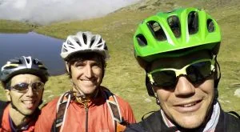
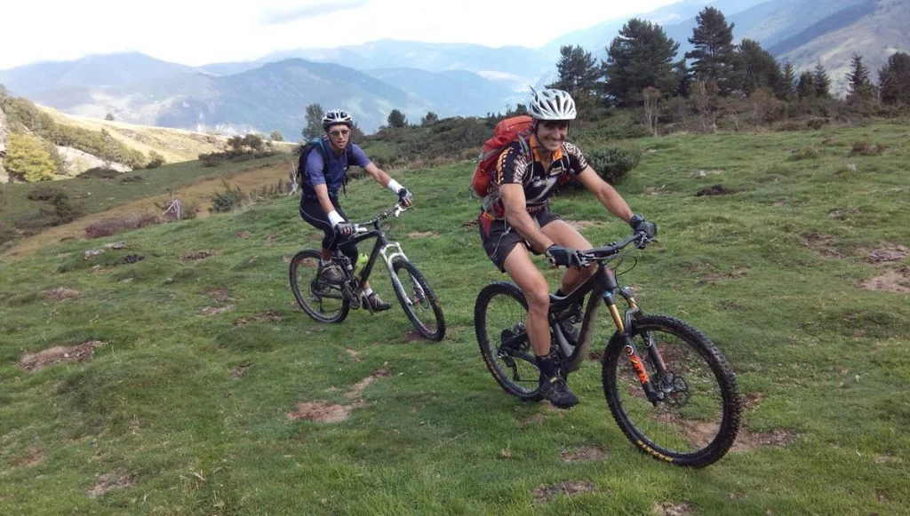
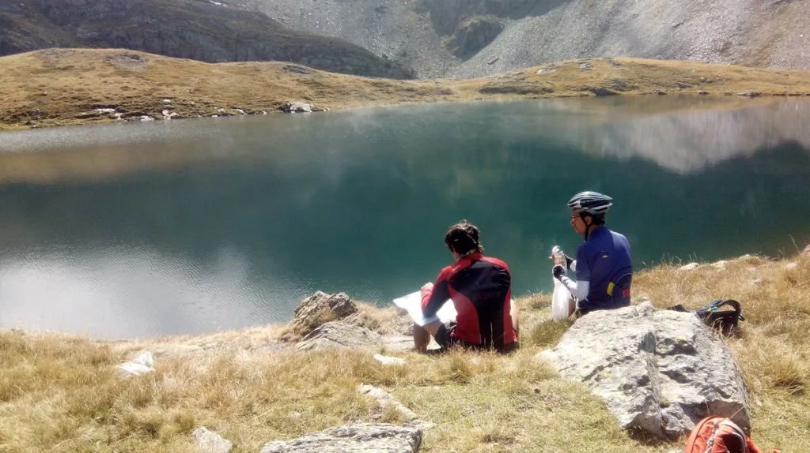

El pasado sábado los globeros jR, LaTrek y AlbertoEpic hicieron coincidir sus coordenadas espacio-temporales para realizar una actividad con sabor añejo. Una ruta de cicloalpinismo similar a las que hacían el siglo pasado...

La jornada empieza con madrugón y acomodamiento de los tres en la misma furgo en Aínsa, para desplazarse hasta Saint-Lary-Soulan, punto de inicio de la ruta. Desde allí comienza el ascenso, primero por carretera, luego por pista y finalmente por sendero (Ciclable sólo si tienes tantos Watios como el doctor LaTrek).

 LaTrek y jR en pleno ascenso.

 Almorzando frente al lago, se estaba de cine...

Desde los Lacs de Consaterre, llega el momento vintage, de la imaginación, del gusto por la exploración que a veces sale bien y a veces sale mal... En lugar de bajar por donde han subido (Eso de hacer rutas lineales de ida y vuelta no tiene aliciente) hacen el descenso por otro valle. La bajada resulta laboriosa: ciclable al 98'9%, requiere mucha concentración: variada, tramos rápidos, otros lentos, otros todavía más lentos, empinada, técnica, húmeda y resbaladiza... En fin, una orgía de pilotaje fino!

Llegados a Tramezaïgues, bajan un tramito de carretera y se vuelven a desviar a la derecha para coger un sendero de bajada con carácter más actual, típico de enduro, técnico pero rápido y con mucho 'flow'. Aquí los bikers de la zona terminan la bajada y sacan el móvil para pedir otra subida en furgoneta.

Los cicloalpinistas globeros, con ese subidón de adrenalina final, llegan a la furgoneta y se vuelven a su casa, con energía positiva para aguantar otra semana más.
<iframe src="http://www.gpsies.com/mapOnly.do?fileId=vjnrcrerqdynuznb" width="100%" height="500" frameborder="0" marginwidth="0" marginheight="0" scrolling="no"></iframe>
Para los ávidos de datos, esta ruta:
<ul>
<li>28km</li>
<li>1976m desnivel+</li>
</ul>
Puedes conseguir el track de la ruta en la <a href="https://soloquedalopeor.com/tracks-gps/">sección correspondiente</a> de la web.

