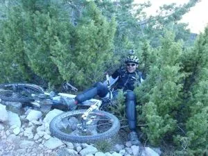

<table cellpadding="0" cellspacing="0" style="float: right; margin-left: 1em; text-align: right;"><tbody><tr><td style="text-align: center;"></td></tr><tr><td style="text-align: center;">Son las exigencias del guión: es necesaria una toma falsa...</td></tr></tbody></table>Seguimos esperando a que nieve, y seguimos haciendo planes con las btt. En este caso, marchamos a Nocito para desde allí subir al Tozal de Guara.

La ruta de ascenso: Nocito - Ref. Los Fenales - collado de Ballemona - cima. Para el descenso, tomamos una senda que baja directa al refugio de Los Fenales, y de allí por otro sendero hasta el mismo Nocito.

En total, 35km y 1.500m de desnivel+ acumulado.

Especialistas: Tai, Miguel Ángel, Luzia y AlbertoEpic.

Puedes ver las fotos de Luzia, el track y más detalles de la ruta en <a href="http://notepierdas.soloquedalopeor.com/ruta.php?id=43">No Te Pierdas...</a>

<iframe allowfullscreen="" frameborder="0" height="404" src="https://www.youtube.com/embed/TNcMdKSaWX8?rel=0" width="657"></iframe>

