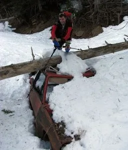
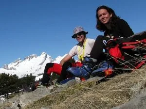
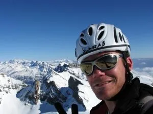

El otro día me llamó Marta, y quedamos en subir al pico Collarada. Lo curioso fue cuando, en el momento de cerrar el coche y coger la mochila... Oh, nooooo, me he olvidado la comida en casa!!!

Menos mal que Marta lleva unos kit-kats y una bolsita de pan de pipas. Habrá que compartir eso...

Comenzamos a subir por el barranco de los Azús, pasando por el mítico coche destartalado.

Aprovechamos un claro sin nieve para estar un buen rato gozando del silencio de las montañas en un día cálido, primaveral, y saboreando sin prisas un trocito de pan de pipas.

Un poco antes de la cima, Marta decide quedarse esperando, disfrutando de un día espectacular: 'no wind, no clouds, summit day!'.

Así que me pego un sofocón para no tardar mucho, y me acerco a la cima, para mí solo, silencio total, sólo un quebrantahuesos me observa desde las alturas.

Unos días después he tenido tiempo de preparar un cutre-montaje con los videos que filmé el día de Collarada, jugando a Jesús Calleja en 'Desafío Extremo'...

https://vimeo.com/3596472

