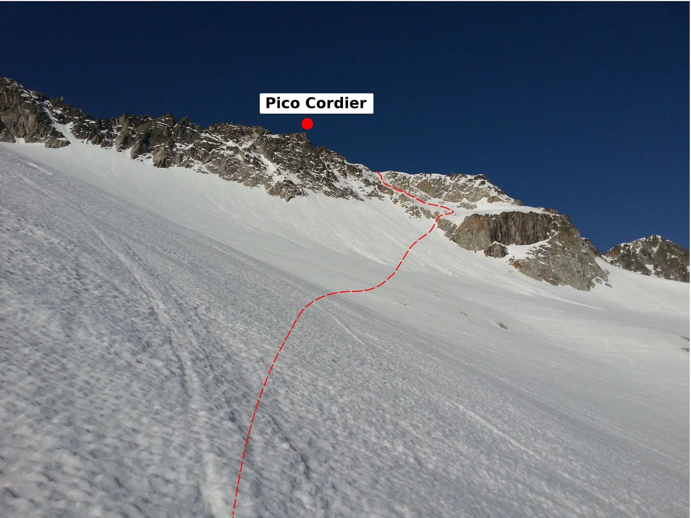
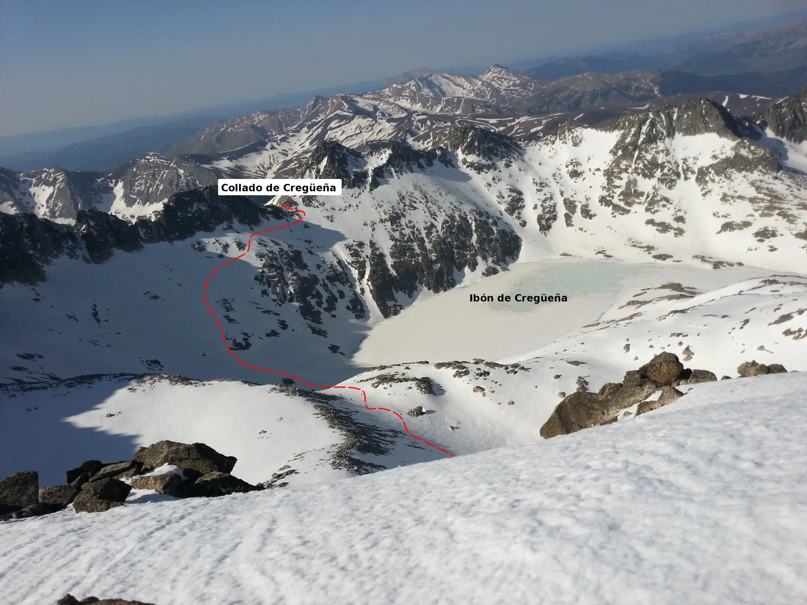
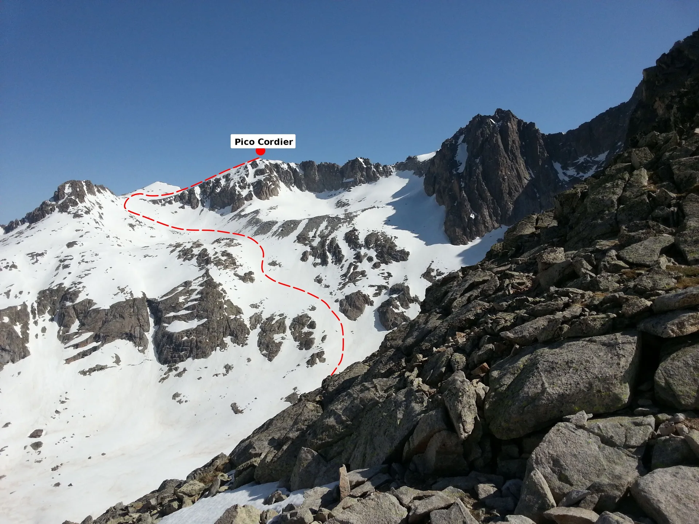
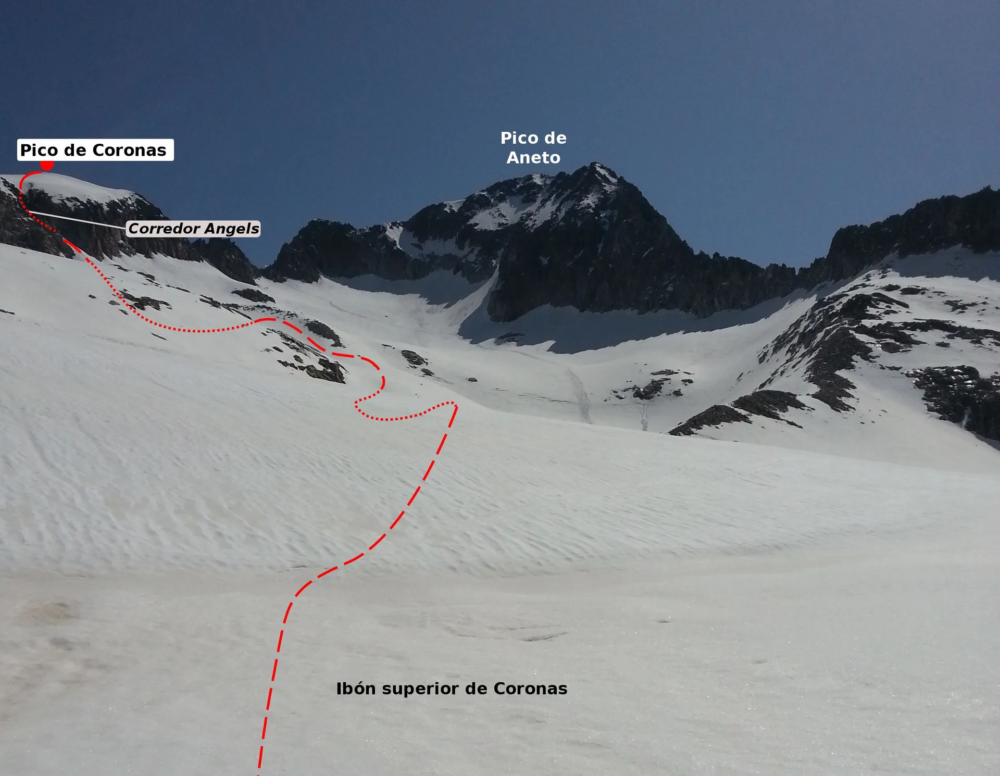

El pasado sábado tocaba despedir la temporada de esquí de travesía, y para seguir la tradición había que ir al macizo de las Maladetas. Allí tenemos a AlbertoEpic, a las 4:23am, parando el despertador en Benasque y empezando la jornada. A las 5:50am comenzaba la ruta un poco antes de plan d'Están. La 'desgracia' de tener el Aneto aqui hace que esto esté lleno de gente, y del refugio de La Renclusa hasta el Portillón Superior se sube 'en modo romería'.

Menos mal que todavía quedan lugares donde disfrutar de la montaña... Aqui comienza la ruta más solitaria: ascensión al pico Cordier.

Desde su cima, toca seguir el cordal hacia el pico Sayó, y vemos claramente nuestro próximo objetivo: el collado de Cregüeña.

Bajamos hacia el ibón de Cregüeña (Cuidado!!! Dejando a la derecha el ibón de Cordier) y remontamos con un empinado flanqueo hasta el collado de Cregüeña. Es importante en esta bajada acertar con el paso bueno, porque a la derecha nos quedan palas muy tentadoras... pero sin salida!
Ya desde el collado de Cregüeña, volvemos la vista atrás y el paso se ve claro...

Desde el collado de Cregüeña, espectacular descenso al ibón superior de Coronas, y desde allí podemos ver la última subida del día: el ascenso al pico de Coronas por el corredor Angels.

Una vez en la cima, ver el Aneto casi asusta: ¡está a tope de gente, parece un centro comercial! Toca comer algo, respirar hondo, y unirse al rebaño para bajar por el clásico descenso del Aneto a Aigualluts...

Y fin de la temporada: escasos 3.000m de desnivel+, algo menos de 10h y 25km después, AlbertoEpic llegaba al coche, dando por concluída esta temporada de esquí de travesía. Ahora ya va siendo hora de pedalear más...

<iframe src="http://www.gpsies.com/mapOnly.do?fileId=mpwyshtptntoxuka" width="100%" height="600" frameborder="0" marginwidth="3" marginheight="3" scrolling="no"></iframe>
