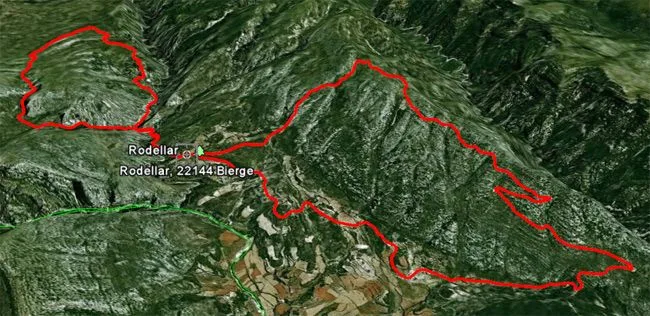

Interrumpimos la serie Uttarakhand 2011 para hacernos eco de la actividad globeril del pasado sábado: los globeros Morenetti, Ángel, jR, Marga, Luzia, AlbertoEpic y el Flow Master José se dieron cita en Rodellar con las btt para hacer una ruta endurera 'larga pero dura'. Salida de Rodellar, bajada al Mascún, subida porteando por el barranco de Andrebot, dolmen de la Losa Mora, Otín, bajada por La Costera al Mascún, subida a Rodellar, Las Almunias, sierra de Balced y descenso trialero a Rodellar. 

<table align="center" cellpadding="0" cellspacing="0" style="margin-left: auto; margin-right: auto; text-align: center;"><tbody><tr><td style="text-align: center;"></td></tr><tr><td style="text-align: center;">El '8' de Rodellar. Primero el bucle superior, acompañados por Tai...</td></tr></tbody></table>Para los adictos a las estadísticas:

Tiempo total: 7h 30min (Sólo 3h en movimiento, juajua!)

Distancia total: 29km

Desnivel+ acumulado: 1.403m

Puedes ver fotos en los siguientes enlaces:

Fotos de <a href="https://picasaweb.google.com/100454682559352108335/20111126RodellarBtt?authkey=Gv1sRgCIe8gJbXhcSMIQ" target="_blank">Ángel</a>  |  <a href="https://picasaweb.google.com/111407206456416663507/111126RutaPorRodellar?authkey=Gv1sRgCIDS18bSyPDcTw" target="_blank">José</a>  | <a href="https://picasaweb.google.com/115384366959964769831/BTTRodellar261111?authuser=0&authkey=Gv1sRgCIzZj5mchPrLMg&feat=directlink" target="_blank">Luzia&AlbertoEpic</a>.

