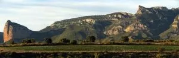
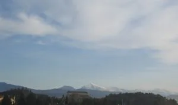

Por gentileza del ilustre globero, reconocido fotógrafo y mejor persona <a href="http://flickr.com/photos/7413708%40N08/">Rafa Moreno</a> nos llega este perfil de la sierra de Guara que parece un gigante dormido, con la Peña de Amán por pies -¿quién dijo que los zapatos de plataforma eran un invento moderno?-, mientras que la "tocha" aguileña estaría formada por el Picón o Pico del Mediodía. Según Rafa algún día se despertará para hacer justicia en este mundo.

Hace unos días tuve la suerte de subir en un día espléndido al dedo gordo del pie a hacerle unas cosquillicas ayudado de unos buitres, pero nada, que no se despierta el tío, ¡con lo necesitado que está el mundo de justicia!

Para llegar a la nariz ya se complica un poco más la cosa, de hecho hay globeros con un bajo porcentaje de éxito en sus asaltos a cumbre.  En ambas ascensiones se recomienda como mínimo unas polainas (ya sabemos cómo se las gasta la sierra), pero seguro que con lo que triunfas es con una desbrozadora.

Otros globeros apuntan la existencia de otro gigante en la sierra (Leyendas del Pirineo, de Rafael Andolz, pag 51), el hombre muerto de Guara, con Fragineto por cabeza y Guara son las manos en el pecho.

Aquí hay distintos enfoques, yo sigo viendo más claro el primer gigante, bien es cierto que la segunda foto probablemente no hace justicia al retratado.... y tú ¿cómo lo ves?
