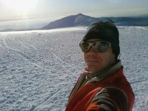
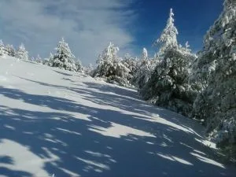
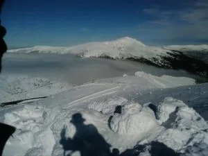
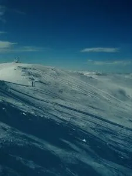

Hoy he aprovechado que con las últimas nevadas generalizadas está todo el monte nevado, sea donde sea, para salir a foquear por la sierra de Guadarrama.

He salido del puerto de Navacerrada, subido a la Bola del Mundo, bajado por Valdesquí a Cotos... Hasta aquí todo normal. Luego pensaba subir a Peñalara, pero he cambiado de planes. Parece que hay mucha nieve, pero a la hora de la verdad sólo vale para 'guarrear': estaba super incómodo, la capita de nieve sobre la vegetación se hundía cada 3 pasos y caías hasta el suelo de golpe, con dificultades para salir del agujero... 

Así que he decidido no ir a Peñalara (Sin bajada buena) y he girado hacia del refugio del Pingarrón, de ahí al cerro de Valdemartín, y otra vez Bola del Mundo y al coche.

Vuelta a comer a casa. Aunque en las fotos no se aprecie, -5ºC, fuerte viento, y muchos ratos de niebla espesa...

Anécdotas? Me he olvidado la cámara de fotos. Éstas son sacadas con el móvil, en plan turista... Me llevo de recuerdo un super-agujero en la suela de un esquí. Ahora pesa 10g menos...

<table width="90%" align="center" bgcolor="cccccc" cellpadding="5" cellspacing="5"><tbody><tr><td>

</td><td>En la cima de la Bola del Mundo. Al fondo, La Maliciosa.</td></tr><tr><td>

</td><td>Por la Loma de los Noruegos, hacia el puerto de Cotos.</td></tr><tr><td>

</td><td>Desde el Cerro de Valdemartín, al fondo, Peñalara. El puerto de Cotos bajo la niebla.</td></tr><tr><td>

</td><td>Desde las cercanías del Cerro de Valdemartín, la Bola del mundo.</td></tr></tbody></table>
