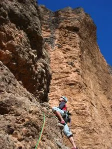
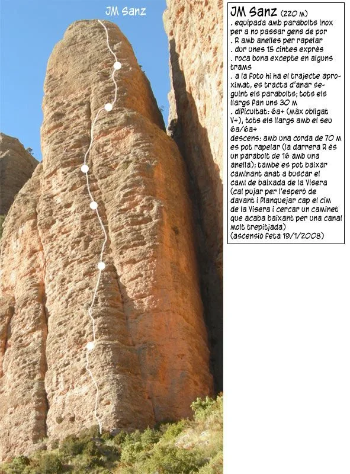
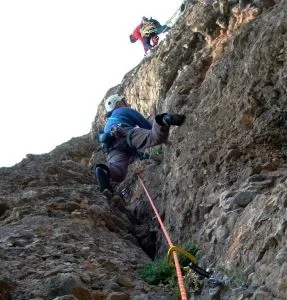
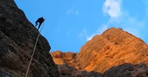

En esta época, ideal para pedalear, en soloquedalopeor estamos que nos subimos por las paredes; además de la btt, necesitamos llenar el hueco que nos dejan los barrancos (Demasiado frío ahora) y el esquí de travesía (Demasiado calor ahora). Así que, el otro día, decidimos subir al mallo Frechín, en Riglos, por la <b><i>vía J.A. Sanz (220m, 6a+, V oblig.)</i></b>.

Cordada de tres, Luzia y AlbertoEpic asesorados por el gran maestro Yodacol. Nos repartimos los largos de primero y bajamos rapelando la vía.

Una apacible tarde de escalada, al caer el sol se convertía en un frío ocaso con un fuerte viento helador. 

Rápido al coche a abrigarse, y encuentro con otros seres míticos del 'ciberdespacio', Julio y Luis, gente ilustre de <a href="http://senderolimite.blogspot.com/" target="_blank">Sendero Límite</a>, que casualmente han hecho lo mismo que nosotros un par de horas antes. Qué pequeño es el monte!

Lo mejor de la tarde de escalada: las pasadas de los buitres con el tren de aterrizaje desplegado, llegando a algún nido cercano; y los 'vuelos' de los escaladores que suben a la visera y caen al vacío a pocos metros de salir por arriba!

