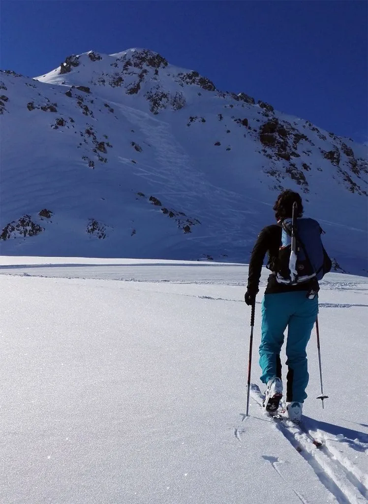
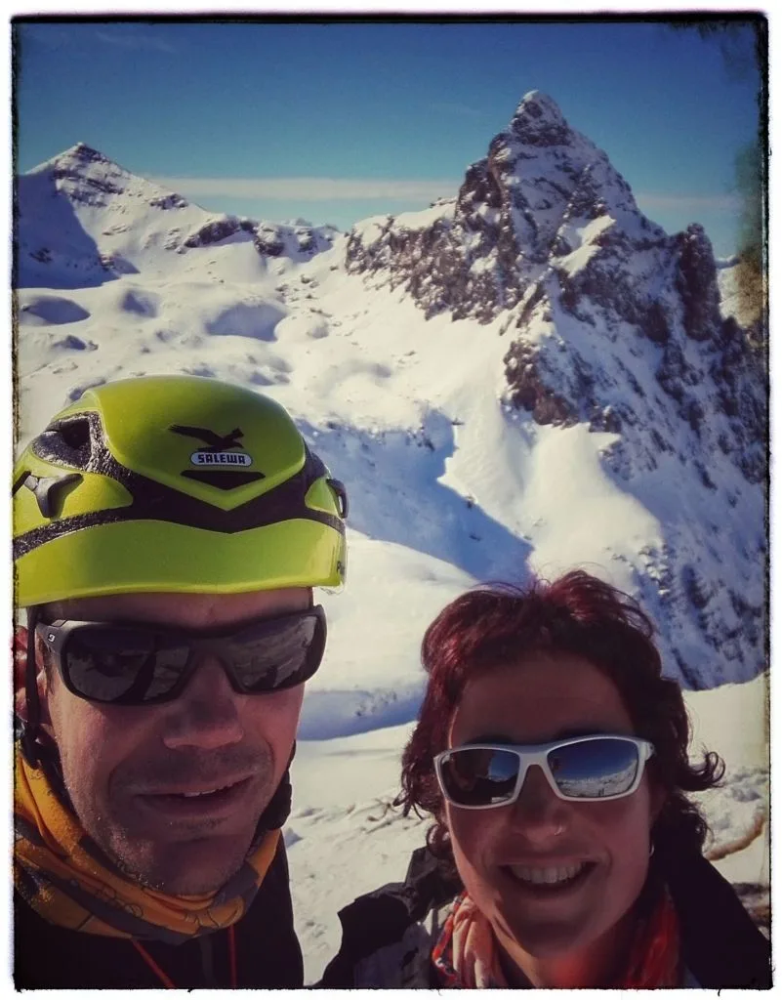
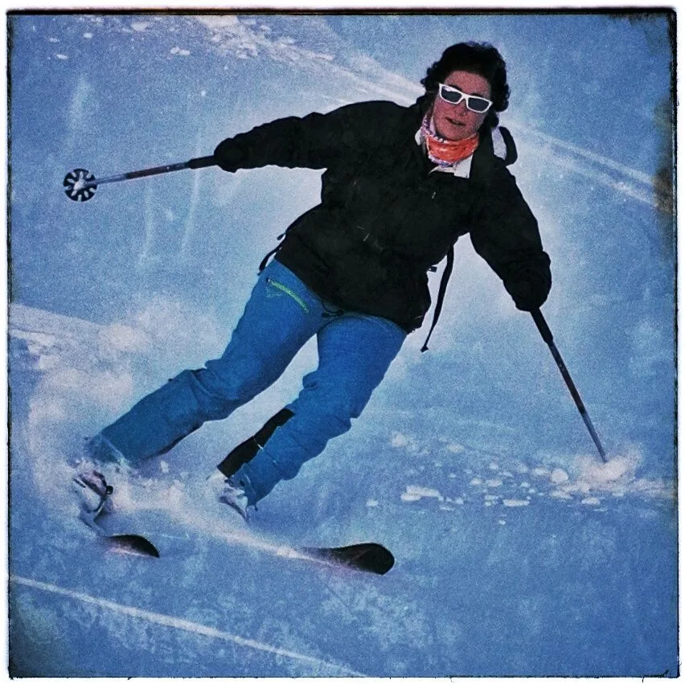

El pasado jueves Luzia y AlbertoEpic hicieron una breve actividad matutina. Continúan con el rodaje de pretemporada, en una temporada que todavía está comenzando a pesar de irse acercando cada vez más hacia su ocaso. Esperemos que la cota de nieve baje algún día...

Para este día, el recorrido elegido discurrió por el parking de Anayet, Majada de Espelunciecha, pico Espelunciecha por la cara Norte, y descenso por la misma N y la Glera de Anayet. El día, perfecto, y la nieve, sin ser de ensueño, sí que era polvorón... :-)
A continuación, algunas fotos.

 Luzia foqueando en dirección a la N del Espelunciecha.

 Luzia y AlbertoEpic, en la cima del Espelunciecha con el Anayet al fondo.

 En el descenso de la N...
