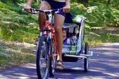

En SQLP vamos poco a poco poniéndonos en marcha, dentro de esta nueva etapa de la vida. Estamos en períodos de pruebas y ensayos para acometer con mínimas garantías las futuras aventuras.

El escenario elegido para los últimos test realizados fue la región de Las Landas.

Allí, una nutrida red de carriles bici resultó ideal para probar cómo es eso de viajar en bici la familia completa, además de celebrar el primer cumpleaños de Sami.

<iframe frameborder="0" height="450" src="https://www.google.com/maps/embed?pb=!1m18!1m12!1m3!1d2978237.983167372!2d-2.3959131519736285!3d43.20035356804287!2m3!1f0!2f0!3f0!3m2!1i1024!2i768!4f13.1!3m3!1m2!1s0xd515b97f9e41755%3A0xce64895631643db1!2sSoorts-Hossegor!5e0!3m2!1ses!2ses!4v1402578615624" style="border: 0;" width="600"></iframe>

Han resultado unas vacaciones activas muy interesantes. A continuación, algunas fotos del Facebook de Luzía:

<table align="center" cellpadding="0" cellspacing="0" style="margin-left: auto; margin-right: auto; text-align: center;"><tbody><tr><td style="text-align: center;"></td></tr><tr><td style="text-align: center;">Buen humor generalizado en el equipo...</td></tr></tbody></table><table cellpadding="0" cellspacing="0" style="margin-left: auto; margin-right: auto; text-align: center;"><tbody><tr><td style="text-align: center;"></td></tr><tr><td style="text-align: center;">Haciendo km por los carriles bici...</td></tr></tbody></table><table align="center" cellpadding="0" cellspacing="0" style="margin-left: auto; margin-right: auto; text-align: center;"><tbody><tr><td style="text-align: center;"></td></tr><tr><td style="text-align: center;">En un viaje en bici es vital una buena alimentación! </td></tr></tbody></table><table align="center" cellpadding="0" cellspacing="0" style="margin-left: auto; margin-right: auto; text-align: center;"><tbody><tr><td style="text-align: center;"></td></tr><tr><td style="text-align: center;">Estudiando la ruta del próximo día.</td></tr></tbody></table><table align="center" cellpadding="0" cellspacing="0" style="margin-left: auto; margin-right: auto; text-align: center;"><tbody><tr><td style="text-align: center;"></td></tr><tr><td style="text-align: center;">En un cumpleaños que se precie no puede faltar un crêpe de Nutella...</td></tr></tbody></table>

