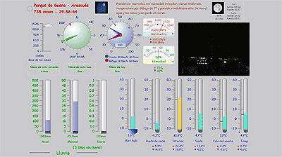

Desde cualquier sitio con internete podemos acceder a los datos de la estación meteorológica instalada en Arascués, con webcam y todo.

Parece muy completa: barómetro, termómetro, anemómetro, higrómetro, históricos de presiones, temperaturas, precipitaciones,... Vamos, el juguete perfecto para jugar a Maldonado!

