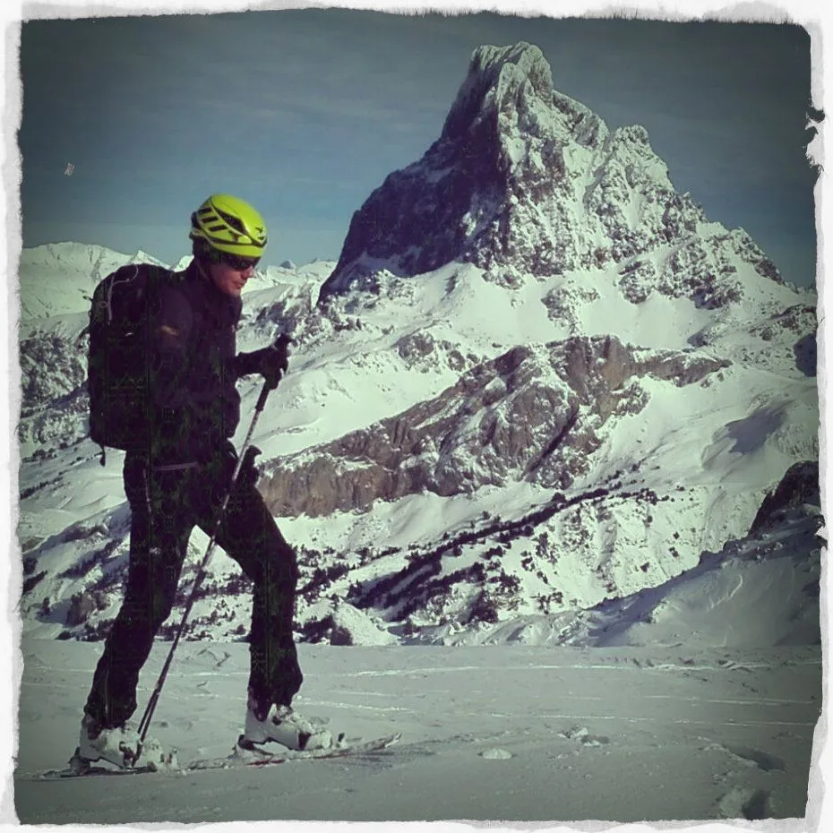

El pasado fin de semana el equipo SQLP dio por inaugurada (Por segunda vez, tras el parón provocado por el eterno anticiclón y la sequía...) la temporada de esquí de travesía. Luzia y AlbertoEpic pudieron coincidir en un mismo grupo (junto a Inazio, Make, Toño y Manuel) en esta ocasión en una ruta por la zona de Astún. No tiene mayor trascendencia, simplemente quería dejar aquí constancia del evento que tan buen sabor de boca nos dejó. A continuación, unas fotos:

 Llegando al collado de los Monjes

 Luzia siguiendo la arista hacia el pico de Astún.

 AlbertoEpic con el Midi d'Ossau al fondo.
