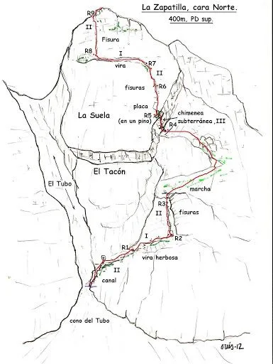

El otro día SQLP estuvo por fin en una actividad sencilla, pero sobre todo muy original. Hace tiempo que AlbertoEpic la tenía en la lista de pendientes, así que cuando le surgió la oportunidad de ir con Eva no tuvo ninguna duda. No importa que por un capricho de la meteo los tórridos días de agosto se convirtieran en un día con niebla, viento, lluvia y a 5ºC; no importa que en Huesca fuera el día del Chupinazo, en las fiestas de San Lorenzo. Había que aprovechar la oportunidad.  Y su fe fue recompensada con un día mítico!

A continuación, el vídeo de la actividad:
<iframe src="https://www.youtube.com/embed/S-mGSh63swI?showinfo=0" width="640" height="360" frameborder="0" allowfullscreen="allowfullscreen"></iframe>

También hemos añadido el track a nuestra base de datos:
<iframe src="https://www.gpsies.com/mapOnly.do?fileId=mrcjotbrinlulhma" width="600" height="400" frameborder="0" marginwidth="0" marginheight="0" scrolling="no"></iframe>

<strong>Algunos datos:</strong>
<ul>
 	<li>La vía ferrata sigue el trazado de la vía reseñada en la imagen:

 La Zapatilla

No se han añadido grapas, simplemente la línea de vida, por lo que se realiza una trepada fácil con casco, arnés y disipador.</li>
 	<li>La sima tiene -90m, lo que supone tres rápeles de unos 30m (Algo menos). Tiene dos entradas, parece más limpia la de la derecha. Extremar las precauciones con la caída de piedras.</li>
</ul>
