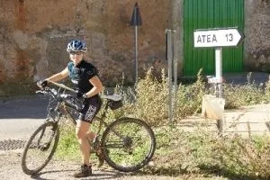
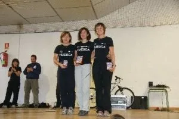

El pasado domingo se celebró en Used la última prueba de la Liga Aragonesa de Orientación en BTT.

En categoría masculina se echó de menos a algún globero que otro, que habían preferido marchar a otra prueba de orientación a pie.

Como viene siendo habitual, la clasificación femenina estuvo dominada por las 'chicas de negro' de Peña Guara...

Puedes ver las clasificaciones de la carrera haciendo <a href="http://www.clubibon.es/docs/folletos/used_08/used_parciales.html">click aqui...</a> (Estas clasificaciones están extraídas de la web del <a href="http://www.clubibon.es/">Club Ibón de Orientación</a>)
