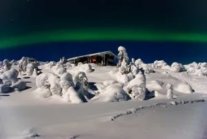

<link rel="File-List" href="file:///C:%5CDOCUME%7E1%5Crafa%5CCONFIG%7E1%5CTemp%5Cmsohtml1%5C01%5Cclip_filelist.xml"><o:smarttagtype namespaceuri="urn:schemas-microsoft-com:office:smarttags" name="metricconverter"></o:smarttagtype><!--[if gte mso 9]><xml>  <w:worddocument>   <w:view>Normal</w:View>   <w:zoom>0</w:Zoom>   <w:hyphenationzone>21</w:HyphenationZone>   <w:punctuationkerning/>   <w:validateagainstschemas/>   <w:saveifxmlinval>false</w:SaveIfXMLInvalid>   <w:ignoremixedcontent>false</w:IgnoreMixedContent>   <w:alwaysshowplaceholdertext>false</w:AlwaysShowPlaceholderText>   <w:compatibility>    <w:breakwrappedtables/>    <w:snaptogridincell/>    <w:wraptextwithpunct/>    <w:useasianbreakrules/>    <w:dontgrowautofit/>   </w:Compatibility>   <w:browserlevel>MicrosoftInternetExplorer4</w:BrowserLevel>  </w:WordDocument> </xml><![endif]--><!--[if gte mso 9]><xml>  <w:latentstyles deflockedstate="false" latentstylecount="156">  </w:LatentStyles> </xml><![endif]--><!--[if gte mso 10]>  <![endif]--><!--[if gte mso 9]><xml>  <o:shapedefaults ext="edit" spidmax="1026"> </xml><![endif]--><!--[if gte mso 9]><xml>  <o:shapelayout ext="edit">   <o:idmap ext="edit" data="1">  </o:shapelayout></xml><![endif]-->   Ya hemos vuelto del pais donde hace mas frío que en el congelador de tu casa, donde la humedad precipita en forma de brillantina de cristales de hielo y donde la nieve no son bolisas  sino perfectas estrellas de todas las formas.<o:p></o:p>

Personalmente este viaje ha superado todas mis espectativas. A parte de que nos lo hemos pasado de maravilla y nos hemos reído un montón, creo que es el segundo sitio mas bonito en el que he estado. No dejas de alucinar con los paisajes y la actividad  para disfrutarla a cada momento.<o:p></o:p>

En total <st1:metricconverter product st="on">70 km</st1:metricconverter> con nuestras pulkas a una media de <st1:metricconverter product st="on">2,5 km</st1:metricconverter> a la hora y sobre –18º, durmiendo en acogedoras cabañas y sin ver practicamente a nadie.<o:p></o:p>

Aunque estamos acostumbrados a los descensos de aquí, llanear por Laponia es un auténtico placer.<o:p></o:p>

