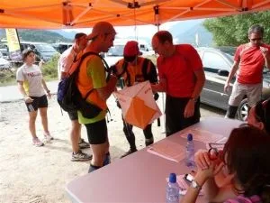
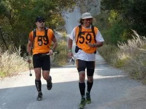
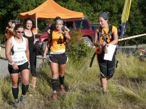
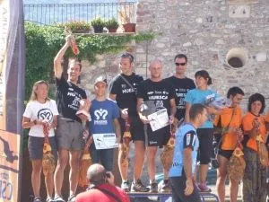
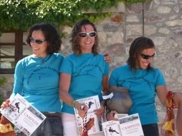

 Durante el pasado fin de semana se disputó la 2ª edición del Raid de Aventura de la Ribagorza, prueba puntuable para la Liga Española de la modalidad y que además era el Campeonato de Aragón. Hasta aquí se desplazaron nada menos que 5 equipos del club Peña Guara (en categoría Elite, Peña Guara – Oxigen, en Aventura Masculina, Peña Guara – Mastos, en Aventura Mixto, Peña Guara Aventura y Peña Guara Imagine, y en Aventura Femenino, Peña Guara Somos Nenas o Marines).

 La prueba daba comienzo el sábado a las 8:30h desde la zona polideportiva de Graus, desde aquí los corredores tuvieron que recorrer 6,4km de piragua por el río Ésera para terminar en uno de los embarcaderos del embalse de Barasona y volver desde aquí en BTT de nuevo hasta Graus. La segunda sección fue una orientación urbana a pie por el casco de Graus para pasar a la primera sección de orientación en BTT que llevó a los corredores hasta el pueblo abandonado de Centenera, pasando primero por Capella donde tuvieron que realizar una prueba especial de Tiro con Arco.

<i>Toño, Carlos y Miren en una de las transiciones</i>

 Hasta esta sección no se marcaron muchas diferencias entre los equipos, pero la cuarta etapa fue un Trekking hasta Bacamorta donde el calor y la orientación hicieron mella en muchos equipos, siendo esta una de las etapas que marcaron el Raid. La quinta sección era de nuevo una orientación en BTT, la prueba más dura del Raid, 37km y 1300m de desnivel que llevaron a los aventureros hasta la localidad de Llert, a los pies del mágico macizo del Turbón. Muchos equipos decidieron saltarse esta etapa de BTT por su estado físico y la dureza de la misma, ya que muchos corredores llegaron a Llert de noche y tras haber empujado la bici durante bastante tiempo.

<i>José Orte y César Gracia llegando del Trekking</i>

 La sexta y última sección del sábado fue un Trekking alpino que adentró a los corredores por el valle de Bardají para terminar bajando por Gabás hasta llegar a la meta situada en Castejón de Sos, etapa que casi todos los equipos realizaron de noche, lo cual dificultó mucho más el progreso y la orientación de los corredores.

 El primer equipo de Elite que alcanzó la meta fue el Peña Guara-Oxigen, una media hora más tarde de lo previsto y seguido muy de cerca por el equipo catalán Wind X-trem. En categoría Aventura el primero en llegar fue el equipo Turboclimbers y en Mixto el equipo oscense Peña Guara Aventura.

<i>Las Nenas o Marines antes de empezar la BTT</i>

 Para la etapa del domingo la organización había preparado unas pruebas técnicas para hacer el final del Raid más espectacular y no se esperaban grandes cambios en las clasificaciones, sin embargo no fue así y hubo bastantes cambios en todas las categorías.

 La primera sección fue una orientación urbana por Castejón de Sos en la que los corredores tenían que pintarse los puntos de control en una foto aérea a través de rumbos y distancias. 

 La segunda prueba fue una combinada, los corredores partieron de Castejón de Sos con las bicicletas y tras pasar por un punto de control llegaron a los alrededores de Sesué, donde la categoría Elite tenía que realizar una espectacular Vía Ferrata y los corredores de Aventura tenían que hacer una vía de escalada mientras el compañero hacía una tirolina que terminaba en una poza del río Ésera. Tras estas pruebas técnicas volvieron a montarse en sus bicicletas para aproximarse a la localidad de Liri, donde comenzaba la última prueba del Raid. Los corredores se enfundaron los neoprenos y disfrutaron del descenso del barranco de las Cascadas de Liri, y para terminar tuvieron que alcanzar Castejón de Sos con una pequeña carrera a pie hasta la meta.

<i>Podium Categoría Mixta</i>

 Yo quiero destacar a nuestras Nenas o Marines, porque es una pasada las ganas que le ponen y la alegría con la que se tomaron el Raid, una pena que no pudieran terminar la última sección del sábado porque nos disteis una lección a todos!! A seguir así máquinas!!

- Las clasificaciones finales quedaron de la siguiente manera: 

Categoría Élite:

1º Wind X-Treme

2º Peña Guara Oxigen (Xavi Rodríguez, Saül Abril y Albert Vilana)

3º Turismo de Priego, O-Adema

Categoría Aventura Masculino:

1º Turboclimbers

2º Imperdible

3º Asturextreme-Los Martinez AVE

Categoría Aventura Mixto:

1º Peña Guara Aventura (Miren Andueza, Carlos Ciria y Antonio García)

2º Peña Guara Imagine (Natalia Ciprián, Jesús Alastruey y Jorge García)

3º Wakhán Raiders

Categoría Aventura Femenino:

1º Peña Guara, Somos Nenas o Marines (Jara Lorés, Esmeralda Gabasa y Marga Plata)

Categorías especiales:

Campeonato de España de Bomberos, Policía Local y Cuerpos de Seguridad del Estado:

1º Javises Raid Team

2º El Chelegal

Campeonato de Aragón:

1º Peña Guara Aventura

2º Javises Raid Team

3º Peña Guara Imagine<o:p></o:p>
