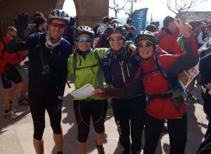

<table cellpadding="0" cellspacing="0" style="float: right; margin-left: 1em; text-align: right;"><tbody><tr><td style="text-align: center;"></td></tr><tr><td style="text-align: center;">Chus, Belén, Esme y Luzia</td></tr></tbody></table>El pasado 24 de marzo se disputó en Yécora este raid de aventura por parejas y de un día. Desde SQLP nos hacemos eco del mismo debido a que hasta allí se desplazó Luzia, de la factoría SoloQuedaLoPeor, formando equipo con Esmeralda Gabasa.

Entre las dos consiguieron dominar la prueba, quedando primeras en categoría femenina. Superaron también a todos los equipos mixtos, y consiguieron una meritoria 23ª plaza entre 70 equipos.

Puedes ver <a href="http://blogs.barrabes.com/post.asp?idPost=5310" target="_blank">aqui la crónica</a> de Luzia.

Mención especial merece Chus, un globero clásico en los raids y todo lo que suene a orientación y petación, que se presentó allí para iniciar a Belén en los raids y quedaron terceros en categoría mixta!

