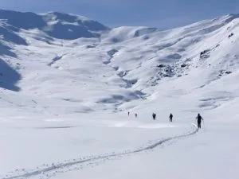
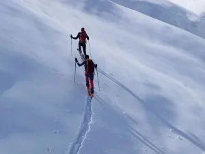
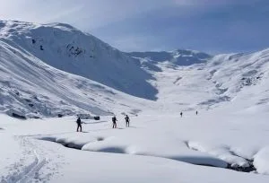
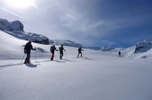
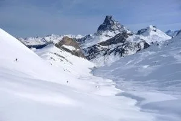
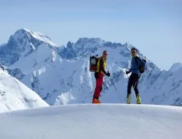
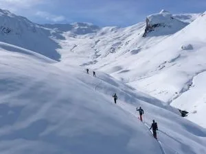
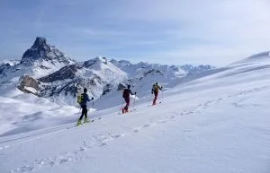
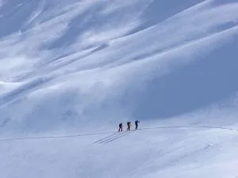
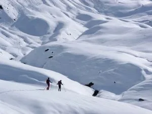

Hoy he hecho la primera salida de esquí de travesía de la temporada (Otros ya llevan varias). El monte está impresionante, parece que sea febrero! La nieve estaba un poco de todo, a veces asquerosilla, a veces buena. El recorrido ha sido el siguiente (Copio-pego de un email de Jorge):

Recorrido:

Parking de Astún (1.700m)– Coll des Moines 2.170m– Desde el collado, bajada a la derecha en dirección NE por vallecito a la derecha del Pic Paradis hasta el llano de la Cabanne de la Glère (1.720m). Allí ponemos pieles de nuevo y giramos a la derecha, para subir al sur por el suave valle en dirección al Collado de Astún (2.180m) y, desde allí mismo, bajamos por el lado español a las pistas de Astún y al coche (Tiempo: 4h 30min).

Haz <a href="http://picasaweb.google.es/dmolinar08/MoinesYAstunCollados#slideshow/5266807052423431058">click aquí</a> para ver una proyección de fotos de Donato.

El grupo estaba formado por Jorge García-Dihinx, Donato Molina, Alex Sola, Ángel Marco, JM Gimeno, Diego Teixeira y Alberto Lafarga. En el collado de Astún nos ha pillado el mítico globero doctor LaTrek. David había salido más tarde de Huesca.

A continuación, puedes ver algunas de las fotos de Jorge de la ruta de hoy:

