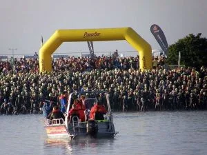
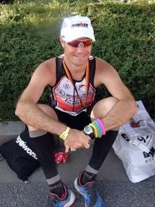

<table align="center" cellpadding="0" cellspacing="0" style="margin-left: auto; margin-right: auto; text-align: center;"><tbody><tr><td style="text-align: center;"></td></tr><tr><td style="text-align: center;">Antes de la salida. Se ve a Toño, con neopreno negro

y gorro amarillo...</td></tr></tbody></table>

<table cellpadding="0" cellspacing="0" style="float: right; margin-left: 1em; text-align: right;"><tbody><tr><td style="text-align: center;"></td></tr><tr><td style="text-align: center;">Toño, después de cruzar

la línea de meta.</td></tr></tbody></table>La actividad globeril está que arde... El pasado domingo tuvo lugar el Ironman de Regensburg, en Alemania. Los globeros nos regocijamos porque Toño García, todo un IronGlober, mecánico amateur, estuvo allí dejándonos con la boca abierta: cada año se supera, en esta ocasión paró el crono con un tiempo de 11h 25min 14seg.

Y eso que según sus impresiones, ese tiempo se puede bajar bastante, ya que se pegó los 3.8km de natación, 180km de bici y 42km de carrera a pie en plan bastante reservón...
