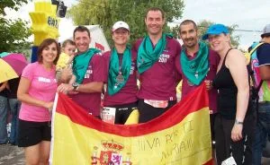
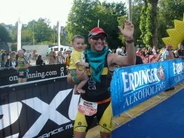
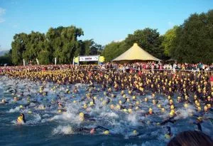

<table cellpadding="0" cellspacing="0" style="float: right; margin-left: 1em; text-align: right;"><tbody><tr><td style="text-align: center;"></td></tr><tr><td style="text-align: center;">Sensaciones 'finisher': alegría, emoción, cansancio,...</td></tr></tbody></table>Hay veces en las que uno se siente orgulloso de pertenecer al clan de los globeros, y de tener amigos como los que tiene. Con el tiempo, los individuos de esta especie se han ido especializando en diversas disciplinas, alcanzando cotas muy altas en todas ellas.

En esta ocasión, hacemos referencia a la expedición oscense que marchó al Ironman de Zürich (3.8km natación - 180.2km bici - 42.2km carrera a pie): Miki, Toño, Esmeralda y Fernando participaron consiguiendo unos tiempazos. Miki es un fuera de serie, con 10h le bastaron.

Toño es ya un ironman confirmado, que se sigue superando (10:39:52).

Mención especial merecen Fernando (12:02:37), reciente papá, que se estrenó en esto del triatlon con un ironman! (Impresionante labor de Nuria, un apoyo indispensable);

<table align="center" cellpadding="0" cellspacing="0" style="margin-left: auto; margin-right: auto; text-align: center;"><tbody><tr><td style="text-align: center;"></td></tr><tr><td style="text-align: center;">Fernando: "<i>(...) entrar así los ultimos metros con Mateo en brazos no hay palabras que puedan describir tal emoción. Ha pasado casi una semana y aun le grito a Mateo eso que oimos al llegar a meta... "Fernando Blasco y Mateos baby" (...)</i>"</td></tr></tbody></table>

y Esme, qué decir de ella... superviviente especialista en superar retos. Paró el crono en 12:44:11 sin haber podido entrenar en condiciones por unas cuantas dolencias, sin haber dejado de dar conversación en todo el ironman (Bueno, nadando casi no habló, para no echarse tragos!).

Puedes leer su crónica haciendo <a href="http://blogs.barrabes.com/post.asp?idPost=4255">click aqui</a>.
<table align="center" cellpadding="0" cellspacing="0" style="margin-left: auto; margin-right: auto; text-align: center;"><tbody><tr><td style="text-align: center;"></td></tr><tr><td style="text-align: center;">Salida de la prueba...</td></tr></tbody></table>

