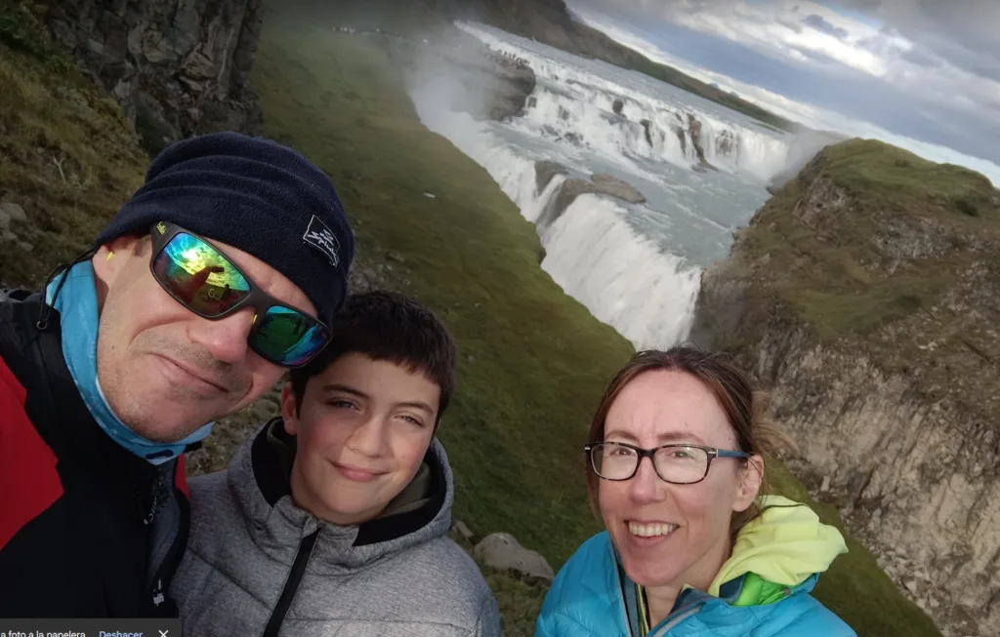
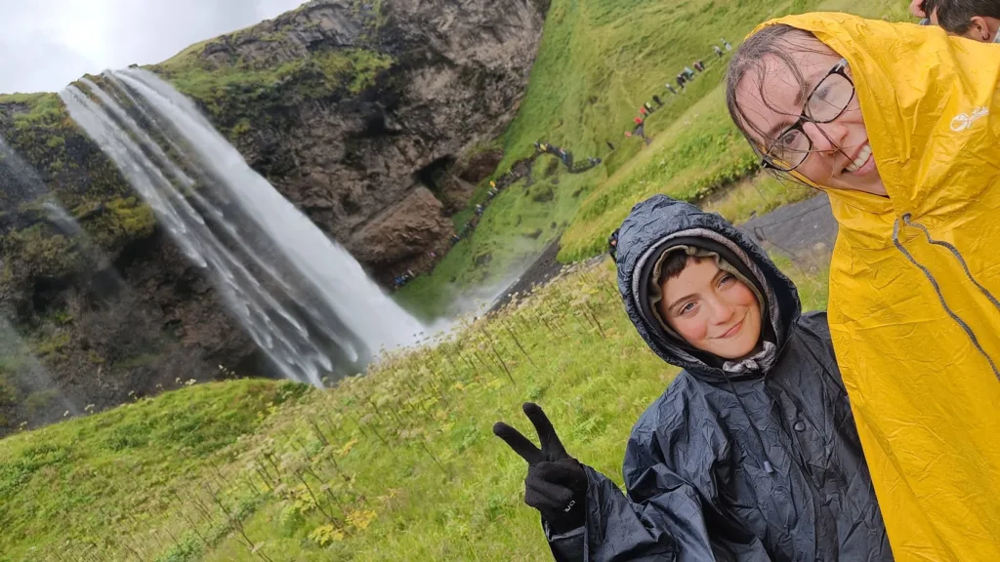
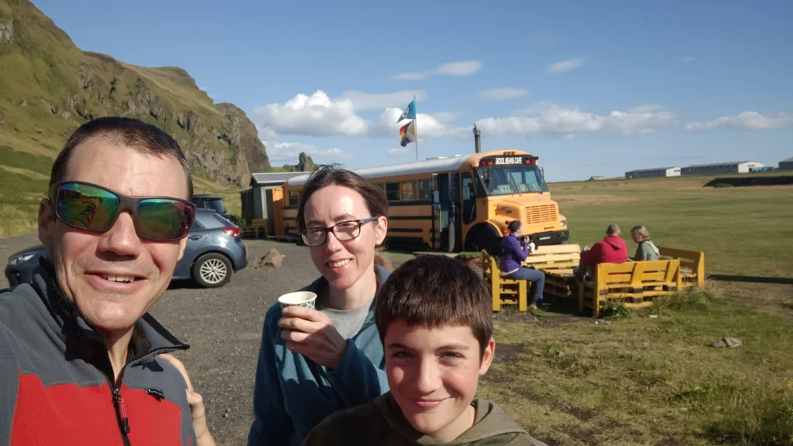
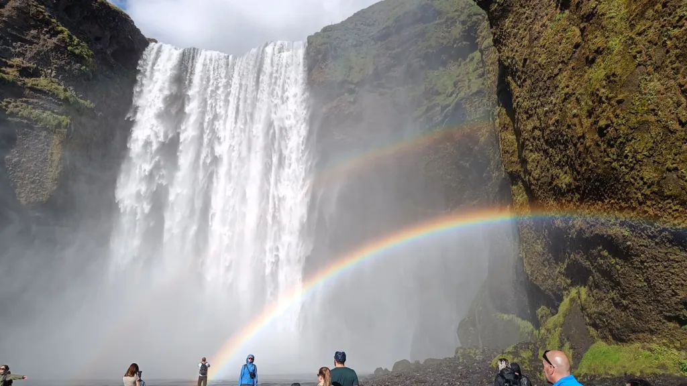
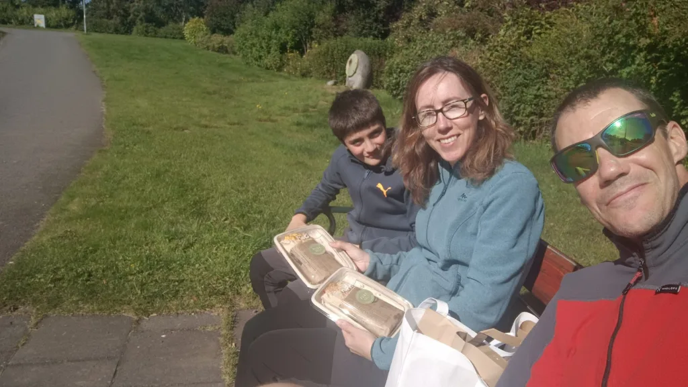
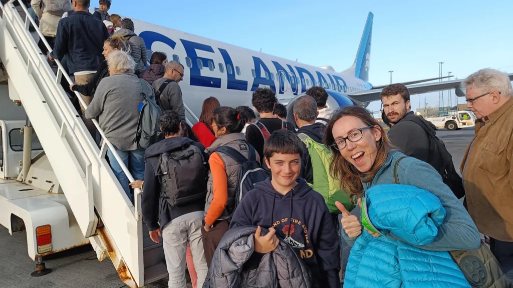

## Cuaderno de bitácora. Extractos del diario de AlbertoEpic...

Finiquitamos el tema de las vacaciones en Islandia con este 'Especial' que contiene el <strong>vídeo resumen</strong> del viaje, un '<strong>Cuaderno de bitácora</strong>' confeccionado a partir de retazos del diario de Albertoepic y los enlaces a todas las '<strong>Iceland Pills</strong>' publicadas anteriormente. Empezamos con el vídeo:

<figure class="wp-block-embed is-type-video is-provider-youtube wp-block-embed-youtube wp-embed-aspect-16-9 wp-has-aspect-ratio">

<iframe width="560" height="315" src="https://www.youtube.com/embed/Wg7myAJ0qbI" title="YouTube video" frameborder="0" allow="accelerometer; autoplay; clipboard-write; encrypted-media; gyroscope; picture-in-picture" allowfullscreen></iframe>

</figure>

<strong>19 agosto 2024</strong>

Son las 6:30pm, estamos en el avión, volando camino de Islandia. Serán unas 4h y pico de vuelo, se hace un poco largo, pero bueno. Había venido preparado con los cascos para ir escuchando música, pero mejor se los he dejado a Sami para que viera una peli (Tenemos pantalla en cada asiento). Y así comienzan nuestras vacaciones en Islandia!!!

*En el aeropuerto de Barcelona.*

<strong>20 agosto 2024</strong>

La jornada comienza con una noche movidita: nos han dado una AC (AutoCaravana) con la batería de servicio muerta, y se apaga la calefacción, así que pasamos algo de frío por la noche. A la mañana toca volver a las oficinas de alquiler a negociar para que nos cambien la batería. Total, que pasamos allí la mañana, y así perdemos un poco de tiempo para el plan previsto.

*Lugar de la primera noche, en medio de la nada... y sin calefacción! :-)*

Por la tarde, nos da tiempo de ver rápidamente <strong>Pingvellir</strong>, <strong><a href="https://soloquedalopeor.com/2024/09/02/gullfoss-iceland-pills-1/" data-type="post" data-id="108283" target="_blank" rel="noreferrer noopener">Gullfoss</a></strong> y <strong><a href="https://soloquedalopeor.com/2024/09/03/strokkur-iceland-pills-2/" data-type="post" data-id="108294" target="_blank" rel="noreferrer noopener">Geysir</a></strong>. Realmente apabullante!

Terminamos la jornada durmiendo en el parking de un supermercado en <strong>Selfoss</strong>.

*Gullfoss, una bestialidad para los que venimos del secano... ;-p*

<strong>21 agosto 2024</strong>

12.26 am, estamos en la AC tomando un picoteo antes de seguir. Hoy toca día de mala meteo, típica de Islandia: viento y llovizna. Llegando a Vik nos ha atrapado un viento huracanado que amenazaba con volcar la AC <em>(Tuvimos que buscar refugio y esperar 4h parados, esperando que pasara el temporal)</em>. La meteo da alerta roja por vientos fuertes, con ráfagas de hasta 100 km/h. Lo de ver frailecillos habrá que dejarlo para mañana... Por la mañana hemos visto la cascada <strong><a href="https://soloquedalopeor.com/2024/09/04/seljalandsfoss-iceland-pills-3/" data-type="post" data-id="108300" target="_blank" rel="noreferrer noopener">Seljalandfoss</a></strong>.  Después del huracán, pudimos llegar al camping de Vik.

*Sami y Cheles después de cruzar tras la cascada de Seljalandfoss...*

<strong>22 agosto 2024</strong>

Salimos de Vik y retrocedemos un poco a ver lo que no pudimos el día anterior por el viento: <strong><a href="https://soloquedalopeor.com/2024/09/10/dyrholaey-iceland-pills-4/" data-type="post" data-id="108304" target="_blank" rel="noreferrer noopener">Dyrhólaey</a></strong>, con los frailecillos, y la Black Beach junto a las columnas de Basalto. Impresionantes las <strong><a href="https://soloquedalopeor.com/2024/09/11/agujas-de-reynisdrangar/" data-type="post" data-id="108308" target="_blank" rel="noreferrer noopener">Agujas de Reynisdrangar</a></strong>, con leyenda y todo... Me deja un poco decepcionado, está todo absolutamente masificado, demasiada gente comparado con cuando estuve con la bici hace unos años. 😣 Y luego continuamos camino hasta <strong>Skaftafell</strong>.

*El equipo SQLP haciendo el canelo con las Agujas de Reynisdrangar al fondo.*

<strong>23 agosto 2024</strong>

Nos levantamos en el camping de Skaftafell que con tan buen criterio eligió Cheles, y nos vamos primero a dar un paseo hasta la lengua del glaciar <strong><a href="https://soloquedalopeor.com/2024/09/12/skaftafellsjokull-iceland-pills-6/" data-type="post" data-id="108313" target="_blank" rel="noreferrer noopener">Skaftafellsjökull</a></strong>. Espectacular, una pena que no se pudiera volar el dron…

*Sami y AlbertoEpic con el Skaftafellsjökull al fondo.*

Terminamos ese bucle y lo enlazamos con otro que se acerca a visitar la cercana cascada de <strong><a href="https://soloquedalopeor.com/2024/09/13/svartifoss-iceland-pills-7/" data-type="post" data-id="108316" target="_blank" rel="noreferrer noopener">Svartifoss</a></strong>. Esta zona empieza a estar un poco menos masificada, con un ambiente más montañero y menos turista de masas.

*Svartifoss.*

<strong>24 agosto 2024</strong>

Hoy ha sido el mejor día hasta la fecha!!! Hemos salido de <strong>Skaftafell</strong> a visitar <strong><a href="https://soloquedalopeor.com/2024/09/20/jokullsarlon-iceland-pills-9/" data-type="post" data-id="108326" target="_blank" rel="noreferrer noopener">Jökullsárlón</a></strong>, pero antes de llegar hemos parado en otra lengua glaciar (<strong><a href="https://soloquedalopeor.com/2024/09/17/fjallsjokull-iceland-pills-7/" data-type="post" data-id="108321" target="_blank" rel="noreferrer noopener">Fjallsjökull</a></strong>) con su laguna llena de pequeños icebergs: <strong>Fjallsárlón</strong>.

*Flipando con la laguna glaciar del Fjallsjökull.*

Luego hemos seguido a <strong><a href="https://soloquedalopeor.com/2024/09/20/jokullsarlon-iceland-pills-9/" target="_blank" rel="noreferrer noopener">Jökullsárlón</a></strong>: simplemente brutal. Glaciar, icebergs, focas, muuuuuchos turistas, y pocos diamantes en la <strong><a href="https://soloquedalopeor.com/2024/09/23/diamond-beach-iceland-pills-10/" data-type="post" data-id="108331" target="_blank" rel="noreferrer noopener">Diamond Beach</a></strong>.

Ya de vuelta, hemos parado en otra lengua glaciar (<strong><a href="https://soloquedalopeor.com/2024/09/24/svinafellsjokull/" data-type="post" data-id="108337" target="_blank" rel="noreferrer noopener">Svínafellsjökull</a></strong>) con laguna, chulísima, con poca gente, y he podido volar el dron sin problemas. Además, no hacía viento. Después, nos hemos animado y hemos vuelto hasta el camping de <strong><a href="https://soloquedalopeor.com/2024/09/27/vik-i-myrdal-iceland-pills-12/" data-type="post" data-id="108342" target="_blank" rel="noreferrer noopener">Vík í Mýrdal</a></strong>.

<strong>25 agosto 2024</strong>

Hoy nos hemos levantado en el camping de <strong><a href="https://soloquedalopeor.com/2024/09/27/vik-i-myrdal-iceland-pills-12/" data-type="post" data-id="108342" target="_blank" rel="noreferrer noopener">Vík í Mýrdal</a></strong>. Hemos subido andando desde Vik hasta el acantilado que separa Vik de la playa <strong>Black Beach</strong>. La idea era conseguir fotos de cerca de frailecillos, pero no ha habido suerte. Había muchos, pero anidaban en un acantilado inaccesible y sólo nos pegaban pasadas por delante a toda velocidad. Muy chulos de ver, pero imposibles de fotografiar sin un potente teleobjetivo!!!

A la vuelta del paseo el cansancio acumulado de los mayores unido al 'aburrimiento' de los pequeños hacen peligrar la agenda marcada! Pero no hay tregua. Comemos un bocata con cuatro cosas del supermercado, un café en el mítico Schoolbus de los Simpsons y como nuevos!

*Mítico autobús escolar de los Simpsons, reconvertido en cafetería.*

Tras el café (Sami un 'hot chocolate') hemos partido camino a <strong><a href="https://soloquedalopeor.com/2024/09/30/skogafoss-iceland-pills-13/" target="_blank" rel="noreferrer noopener">Skógafoss</a></strong>. Una cascada brutal!!! Nos ha gustado mucho y nos ha levantado el ánimo. Luego ya hemos seguido para terminar en el camping municipal de <strong>Reykjavik</strong>.

*Skógafoss, un caudal de agua sólo superado por el caudal de turistas!*

<strong>26 agosto 2024</strong>

Hoy hemos pasado el día en <strong><a href="https://soloquedalopeor.com/2024/10/03/un-paseo-por-reykjavik-iceland-pills-14/" data-type="post" data-id="108349" target="_blank" rel="noreferrer noopener">Reykjavik</a></strong>. Un revival de mi anterior viaje… Mismo camping, paseo por el parque botánico, por las calles de Reykjavik, su iglesia, etc. La nota curiosa: paseando por un parque, de repente llega un dron gigante y entrega un paquete a una señora! Le he preguntado y resulta que era la madre de un tío que se está montando una empresa de entrega de comida mediante drones. He estado hablando con ella, y al final nos ha hecho un pedido de tres fajitas y botellines de zumo.

*Con nuestra comida repartida vía dron!*

Puedes ver a continuación la prueba irrefutable de que lo del 'drone-delivery' no era broma...

<figure class="wp-block-embed is-type-video is-provider-youtube wp-block-embed-youtube wp-embed-aspect-16-9 wp-has-aspect-ratio">

<iframe width="560" height="315" src="https://www.youtube.com/embed/wqBKjJGhJms" title="YouTube video" frameborder="0" allow="accelerometer; autoplay; clipboard-write; encrypted-media; gyroscope; picture-in-picture" allowfullscreen></iframe>

<figcaption class="wp-element-caption">Nuestra primera experiencia con el reparto vía dron...</figcaption></figure>

<strong>27 agosto 2024</strong>

Son las 10.20pm, terminamos de cenar en <strong>Keflavík</strong>, dentro de la AC, en el punto de 'Drop-off' de la AC. Hemos pasado la mañana en el camping municipal de <strong>Reykjavik</strong>, recogiendo y limpiando la AC. Hemos dado un paseo por el fondo del camping, hasta el jardín botánico. Antes de abandonar el camping hemos dejado en las "Estanterías de compartir" algunas cosas: huevos, papel de cocina, leche en polvo,… Seguro que algún mochilero las aprovecha. Y por la tarde, hemos partido hacia <strong>Keflavík</strong>, pero de camino… Tocaba parada a ver el famoso volcán en erupción (<strong>Sundhnúkur</strong>) de <strong>Grindavík</strong>, que tiene el pueblo y el famoso <strong>Blue Lagoon</strong> evacuados!!! Toda la zona está aislada, no dejan acercarse, pero simplemente verlo de lejos es espectacular!!!

He mandado el dron para verlo más de cerca, y casi lo perdemos… Inexplicablemente, a una distancia de 2km, en terreno totalmente despejado, de repente se perdía la señal, supongo que por los calores o gases emanados por el volcán… Menos mal que había programado el dron para RPO en caso de pérdida de señal, je je! Mañana a las 5.15 am despertador. A las 6am nos llevan al aeropuerto y a las 8.25 am despegamos rumbo a BCN.

Después de escribir las líneas anteriores, salgo a mirar si aparecía alguna aurora, y un resplandor rojo tremendo en el cielo me ha hecho pasear unos 10min hasta salir a las afueras del lugar, ya sin farolas, para admirar la grandeza del volcán 😲.

*El volcán de Sundhnúkur en la noche...*

<strong>28 agosto 2024</strong>

Nos levantamos a las 5.15am. Todo según lo previsto, como previsible era que Johann nos fallara, y aparece a las 6.30am. Nada está siendo fácil en este viaje… Luego en el aeropuerto, problemas con el auto check-in y varias cosas más... y terminamos cruzando el aeropuerto a la carrera para llegar a embarcar. El vuelo se me ha hecho largo e incómodo, y desde BCN a Tierz en la furgo ha sido una penitencia. Al menos el tema de la furgo con Aparca&Go ha ido fino como la seda. 😊

*Una que yo me sé, contenta de volver a casa... ;-)*

