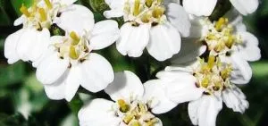
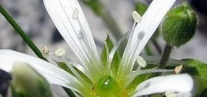

Sí, sí, en efecto... si es que llega la primavera y el monte se llena de flores... Todas las plantas quieren ser las más apetitosas para los abejorros! Y es que, si nos fijamos en las florecillas de cerca, casi dan ganas de ser un abejorro. Aqui va un recopilatorio de flores de esta primavera por el Pirineo.

