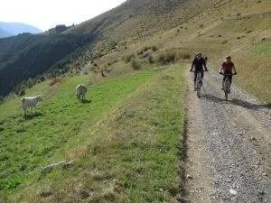
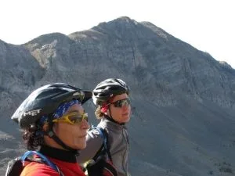
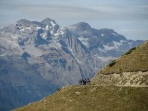
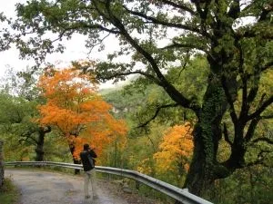
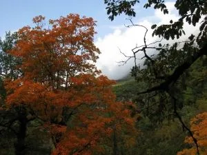

Unos globeros hemos estado pasando el puente del Pilar en una casa Rural de Gistaín. Hemos hecho una ruta en BTT por la zona del collado de la Cruz del Guardia, hemos visto llover y hemos comido abundantemente con el fin de coger reservas para el duro y largo invierno que se avecina.

Aqui puedes ver alguna foto de la ruta en BTT:

Y estas otras son del otoño en la zona del cañón de Añisclo...

