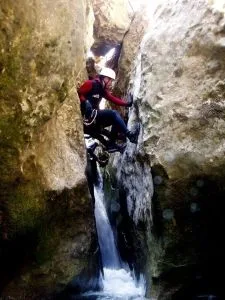

El pasado finde un grupito de globeros estuvo realizando la 'trilogía' de dos barrancos en el mismo día. 

Para abrir boca, los oscuros del Balcés. Y luego, para dar un poco más de emoción al asunto, siguieron con el Gorgonchón.
Hay algunos videos, pero ahora no me da tiempo. Será próximamente. De momento, aqui tienes una foto (Cortesía de Morenetti) del Gorgonchón.

PD.- Aqui tienes un pequeño video filmado por Morenetti en los Oscuros del Balcés...

Video incrustado en formato Flash no compatible actualmente (id legacy: 14008197e7243d53).

