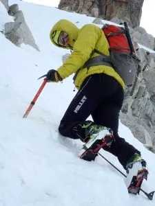

<table cellpadding="0" cellspacing="0" style="float: right; margin-left: 1em; text-align: right;"><tbody><tr><td style="text-align: center;"></td></tr><tr><td style="text-align: center;">En la canal del collado de la Rimaya.</td></tr></tbody></table>El pasado sábado, llegamos por la mañana a Benasque, dejamos los bártulos en el apartamento, y nos vamos a dar un garbeo con los esquís, a ver qué tal está el monte. Tenemos que entrenar mucho si queremos ir a los Alpes...

Dejamos el coche en al aparcamiento del vado de los Llanos del Hospital. Hace un día muy desapacible, mucho frío y un viento huracanado con ráfagas que casi te hacen perder el equilibrio. Momentos de debilidad psicológica: tenemos sueño, es tarde (10.30am)... Pero la certeza de que rendirse ahora a la pereza hará que se nos coman los nervios y el arrepentimiento más tarde, hace que saltemos fuera del coche y salgamos foqueando desde allí mismo.

Primero subimos hasta La Renclusa. Luego un poco más arriba... un poco más... un poco más... vamos calculando la hora límite de retorno, y al final nos plantamos en la cima de la Maladeta Oriental. De los 3.000m para arriba hacía mucho, MUCHO frío, y estuvimos a punto de tener que darnos la vuelta por problemas de frío en las manos.

El descenso, para no aburrirse: nieve muy cambiante, fácil, trabajosa, polvo, venteada, costra, helada, placas de hielo, granizado,... un mix de todos los tipos! Sin duda la mejor en el bosque por debajo de La Renclusa, donde el viento no ha castigado tanto y había un maravilloso polvorón.

A continuación, un pequeño vídeo de la actividad:

 <iframe width="657" height="404" src="https://www.youtube.com/embed/6E-CJH2JLrc" frameborder="0" allowfullscreen></iframe> 

