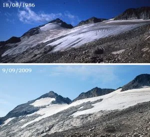

El otro día me regalaron un libro de Jordi Camins donde salen imágenes de la regresión del glaciar del Aneto. A continuación, dos fotos del mismo:

Viendo la evolución que lleva, su extinción definitiva y la de todos los glaciares pirenaicos, parece inevitable en  unos pocos añitos.

Cada vez nieva menos en nuestro Pirineo. Las estaciones de esquí ya estarían cerradas si no fuera por los cañones de nieve. Este invierno estamos teniendo una de las peores temporadas de esquí de travesía que recuerdo. La cota de nieve sube cada año. Los casquetes polares se están fundiendo más rápido de lo que se esperaba, la temperatura del planeta sube...

PERO TRANQUILOS!!!!

Aqui está Marianico (Rajoy) con su primo que nos dice que eso del cambio climático es una tontería... Vale, quizá no haya que preocuparse del calentamiento global, pero yo sí que me preocupo al menos de que nos gobierne un elemento como este! Impresionantes declaraciones... lo flipo!

<iframe allowfullscreen="" frameborder="0" height="360" src="https://www.youtube.com/embed/rfi6v154AI0" width="480"></iframe>

