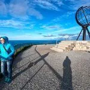
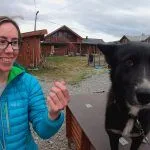
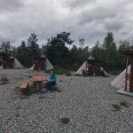
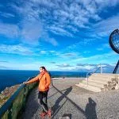
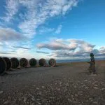

<h4>- Capítulo 1 -</h4>
El equipo SQLP comienza su viaje por Noruega el 17 de agosto, aterrizando en <a href="https://es.wikipedia.org/wiki/Troms%C3%B8" target="_blank" rel="noopener noreferrer">Tromsø</a>. Allí alquilan un coche, y comienzan a subir hacia el norte. Primera noche en Tromsø, y segunda en Alta, en el 'Holmen Husky Lodge', donde duermen en un 'tipi' sami y conocen a un montón de perros de trineo que entrenan allí.

Anterior
Siguiente
Al día siguiente llegan a Cabo Norte. Típica visita de turisteo con muchas fotos y se quedan a dormir en las cabañas del camping más próximo a Nordkapp.

Para variar, AlbertoEpic no desaprovecha la oportunidad y saca una foto esférica en Cabo Norte.

Puedes verla <a href="https://soloquedalopeor.com/producto/cabo-norte-nordkapp-noruega/" target="_blank" rel="noopener noreferrer"><b>haciendo click aquí</b></a>...
<h3>Ascensión al Skipsfjordutsikten en circular</h3>
El 19 de agosto, antes de comenzar a bajar hacia el sur, disponen de una ventana matinal de buen tiempo para empezar a 'mover las patitas' un poco, que ya apetece... Hace muuucho viento, así que desde el camping alzan la vista al horizonte... y la punta más apetecible que se ve resulta ser el Skipsfjordutsikten.

Como campo a través se camina bien (en esas latitudes no hay nada, salvo renos, hierba y granito), improvisan una ruta circular para 'hacer hambre' antes de la lluvia.

A continuación un vídeo de la ruta. También hemos añadido a nuestra base de datos el track del bucle, por si interesa a alguien:https://youtu.be/A8cJ2Mska3U
<iframe src="https://www.gpsies.com/mapOnly.do?fileId=tjvwsogyjtbamibz" width="100%" height="400" frameborder="0" scrolling="no" marginheight="0" marginwidth="0"></iframe>
Continuará...
<h6><a href="https://soloquedalopeor.com/norway-2019/">Regresar al Especial NORWAY2019</a></h6>
