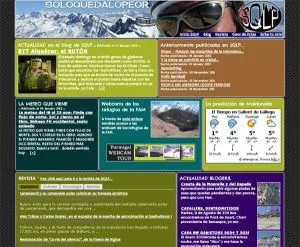

Hola cibernautas. Os comunicamos que en SoloQuedaLoPeor estrenamos diseño/concepto/organización/ llámalo como quieras...

SQLP se había ido extendiendo por la red en diferentes vertientes, que ahora han sido unificadas. Si ahora tecleas en tu navegador <b>www.soloquedalopeor.com</b>, accederás a la portada de la nueva web.

<table align="center" cellpadding="0" cellspacing="0" style="float: right; margin-left: 1em; text-align: right;"><tbody><tr><td style="text-align: center;"></td></tr><tr><td style="text-align: center;">Portada de SQLP</td></tr></tbody></table>Allí tienes cuatro niveles de varios bloques cada uno:

<b>1er nivel:</b> contenidos del <i>blog de SQLP</i>.

<b>2º nivel:</b> dedicado a la <i>predicción meteorológica</i>. Incluye un montón de webcams por el Pirineo.

<b>3er nivel:</b> <i>revista</i>, para la lectura: noticias sobre varios temas y novedades en blogs interesantes.

<b>4º nivel:</b> recoge <i>fotos</i> y <i>videos</i> de Producciones SQLP.

<b>5º nivel:</b> <i>NoTePierdas</i>, la web de rutas de SQLP (versión beta), y otros temas sobre gps.

A la izquierda tienes unas pestañas deslizantes mediante las que puedes acceder a los principales apartados de la web (Inicio, blog SQLP, NTP, Revista), así como seguirnos en <b>facebook</b>, <b>twitter</b> o en nuestro canal de <b>youtube</b>.

No dudes en hacerte seguidor de SQLP y dejar tu opinión y comentarios sobre la nueva web!!!

