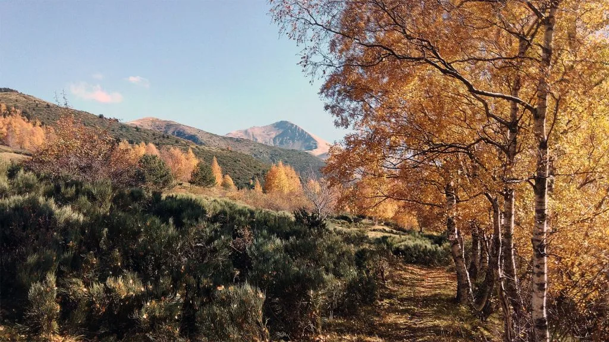

Estaba tan bonito Benasque la semana pasada, que este finde el equipo SQLP al completo ha vuelto otra vez. En esta ocasión, y gracias a la presencia de más globeros (Toño&Esme, Fernando&Nuria), de nuevo se recurrió a la modalidad de 1er y 2º turno, padres y madres. Se les quitaron las telarañas a los senderos de PuroPirineo de Rabaltueras, Montiñero (Eresué), Ñara, Castejón Xpress y Planadona. Puedes ver los tracks en la <a href="https://soloquedalopeor.com/tracks-gps/">sección correspondiente de la web</a>.

Y a continuación, un par de fotos más...
Prados de Montiñero. Al fondo, el Gallinero.

Desde los prados de Montiñero nos espera una laaarga bajada hasta Castejón de Sos...
